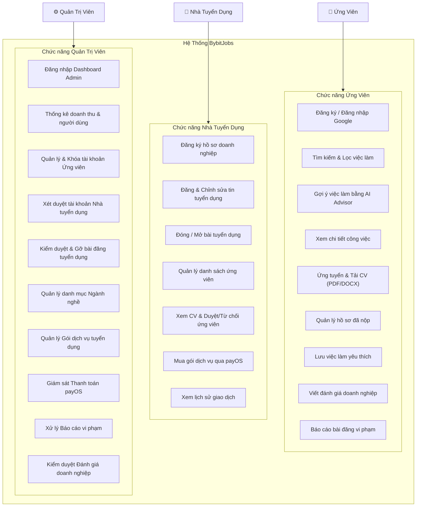
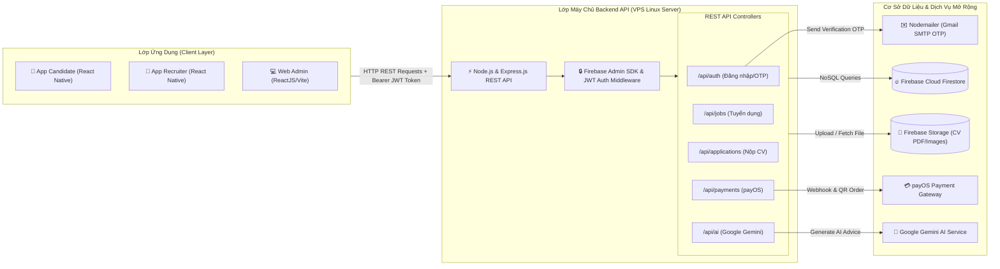
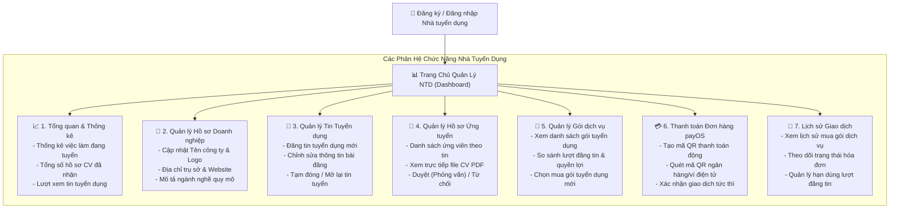
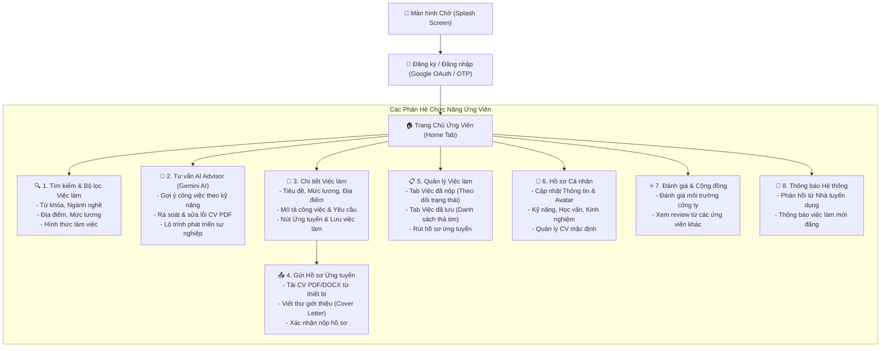
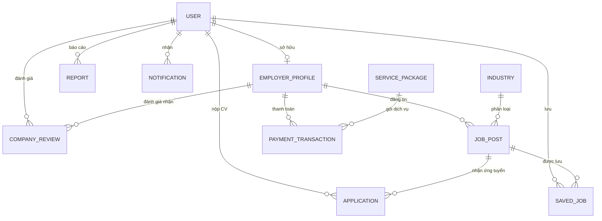

# BÁO CÁO TỐT NGHIỆP: XÂY DỰNG ỨNG DỤNG DI ĐỘNG TÌM KIẾM VIỆC LÀM - BYBITJOBS

**Giảng viên hướng dẫn:** Nguyễn Ngọc Chấn  
**Nhóm sinh viên thực hiện:**
1. Phạm Ngọc Thanh - PS44986 (Trưởng nhóm, PM, Backend)
2. Lê Hoàng Sang - PS44929 (Backend, Analysis)
3. Nguyễn Hoàng Đại - PS44930 (Backend, Functionalities)
4. Lê Thiện Nhân - PS45138 (Frontend, UI/UX)
5. Đoàn Nguyễn Anh Khoa - PS45005 (Frontend, UI/UX)

**Thời gian hoàn thành:** 03/07/2026  
**Đơn vị:** Trường Cao đẳng FPT Polytechnic TP. Hồ Chí Minh

---

# CHƯƠNG 1: GIỚI THIỆU DỰ ÁN

Thế kỷ 21 chứng kiến sự bùng nổ của công nghệ số, làm thay đổi sâu sắc mọi khía cạnh của đời sống xã hội. Trong đó, thị trường lao động và lĩnh vực tuyển dụng là một trong những mảng chịu tác động mạnh mẽ nhất. Sự phổ biến của điện thoại thông minh và mạng Internet đã trao quyền cho người dùng, cho phép các ứng viên chủ động tìm kiếm và kết nối với nhà tuyển dụng một cách nhanh chóng. 

Thực tế cho thấy thị trường nền tảng tìm kiếm việc làm tại Việt Nam tuy sôi động với nhiều thương hiệu lớn, nhưng phần nhiều lại đang tập trung vào nhóm người lao động đã dày dặn kinh nghiệm. Vẫn còn thiếu vắng những không gian thực sự tối ưu cho nhóm đối tượng học sinh, sinh viên – những người cần một công cụ có giao diện trực quan, thao tác ứng tuyển đơn giản và thuật toán gợi ý các công việc linh hoạt bằng AI, phù hợp với lịch học và kinh nghiệm hiện tại.

Xuất phát từ bối cảnh đó, dự án **"BybitJobs"** ra đời với mục tiêu ưu tiên hàng đầu là phục vụ đối tượng học sinh, sinh viên và người tìm việc trẻ, tạo đà để tiếp tục mở rộng hỗ trợ đa dạng các tệp người tìm việc khác trên thị trường.

---

# CHƯƠNG 2: KHẢO SÁT & YÊU CẦU HỆ THỐNG

## 2.1. Yêu cầu từ Khách hàng và Thị trường
1. **Tính tiện lợi và nhanh chóng:** Người dùng có thể tìm kiếm, lọc và ứng tuyển việc làm mọi lúc, mọi nơi chỉ với vài thao tác đơn giản trên thiết bị di động.
2. **Tính minh bạch thông tin:** Cung cấp đầy đủ và rõ ràng thông tin về công việc (mô tả, mức lương, yêu cầu, địa điểm, hình thức làm việc) và thông tin doanh nghiệp tuyển dụng.
3. **Khả năng gợi ý thông minh bằng AI:** Hỗ trợ công cụ gợi ý việc làm dựa trên kỹ năng, hồ sơ và xu hướng tìm kiếm của ứng viên qua Google Gemini AI.
4. **Tính an toàn và bảo mật:** Thông tin cá nhân, hồ sơ ứng tuyển và dữ liệu liên hệ của người dùng phải được bảo vệ, hạn chế rủi ro tin tuyển dụng lừa đảo qua cơ chế kiểm duyệt bài đăng nghiêm ngặt.

## 2.2. Đối tượng sử dụng
Hệ thống **BybitJobs** được thiết kế để phục vụ 3 nhóm đối tượng chính:
1. **Ứng viên (Candidate - App Mobile):** Tìm kiếm việc làm, xem thông tin công ty, tạo và tải CV (PDF/DOCX), ứng tuyển công việc, theo dõi trạng thái ứng tuyển, lưu việc làm yêu thích, tương tác với AI Advisor và đánh giá công ty.
2. **Nhà tuyển dụng (Recruiter - App Mobile & Web Partner):** Quản lý hồ sơ doanh nghiệp, đăng/chỉnh sửa tin tuyển dụng, mua gói dịch vụ tuyển dụng qua cổng payOS, quản lý danh sách ứng viên, xem CV và duyệt/từ chối hồ sơ.
3. **Quản trị viên (Admin - Web Admin):** Theo dõi chỉ số toàn hệ thống, quản lý tài khoản người dùng, xét duyệt doanh nghiệp, kiểm duyệt tin tuyển dụng, quản lý gói dịch vụ, quản lý ngành nghề, giám sát thanh toán/doanh thu, xử lý báo cáo vi phạm và kiểm duyệt đánh giá.

---

# CHƯƠNG 3: PHÂN TÍCH HỆ THỐNG

## 3.1. Mô hình triển khai hệ thống
- **BybitJobs Mobile App (React Native/Expo):** Phục vụ Ứng viên và Nhà tuyển dụng trên nền tảng Android & iOS.
- **BybitJobs Web Admin (ReactJS/Vite/TailwindCSS):** Trang quản trị vận hành dành cho Quản trị viên.
- **BybitJobs API Server (Node.js/Express.js):** RESTful Backend API kết nối Firebase Firestore, Google Gemini AI, cổng thanh toán payOS và Gmail SMTP.

## 3.2. Sơ đồ Use Case Hệ Thống

---

# CHƯƠNG 4: THIẾT KẾ ỨNG DỤNG (CHUẨN HÓA LẠI TOÀN BỘ)

## 4.1. Mô hình công nghệ và kiến trúc
Dự án được xây dựng dựa trên mô hình kiến trúc Client - Server với phân tách rõ ràng giữa giao diện (Client), máy chủ xử lý (Server API) và cơ sở dữ liệu (Database).

### Bảng 4.1: Mô hình công nghệ hệ thống (Technology Stack)

| Thành phần | Công nghệ sử dụng | Mô tả vai trò |
| :--- | :--- | :--- |
| **Server** | VPS (Ubuntu Server), Node.js, Express.js | Máy chủ ảo chạy Backend API xử lý trung gian |
| **Client Mobile** | React Native, TypeScript, Expo | Ứng dụng di động đa nền tảng (Android/iOS) dành cho **Ứng viên** và **Nhà tuyển dụng** |
| **Client Web Admin** | ReactJS, Vite, TailwindCSS, TypeScript | Trang web quản trị hệ thống **dành riêng cho Admin** |
| **Database & Storage** | Firebase (Cloud Firestore & Storage) | Cơ sở dữ liệu NoSQL đám mây & Lưu trữ tệp tin CV (PDF/DOCX), logo công ty |
| **Dịch vụ tích hợp** | Google Gemini AI, payOS SDK, Nodemailer | AI gợi ý việc làm & tư vấn CV, Cổng thanh toán quét mã QR, Email xác thực OTP |

### 4.1.1 Client-Side (Phía người dùng)
- **BybitJobs Mobile App (Dành cho Ứng viên & Nhà tuyển dụng):** Là ứng dụng di động đa nền tảng được phát triển trên nền tảng React Native (Expo Framework) kết hợp với TypeScript, đảm bảo khả năng vận hành tối ưu trên cả hai hệ điều hành Android và iOS. Ứng dụng chịu trách nhiệm cung cấp giao diện tương tác trực quan, hiển thị danh sách việc làm, thu thập dữ liệu người dùng (nộp hồ sơ CV, đăng tin tuyển dụng) và giao tiếp trực tiếp với hệ thống Backend API.
- **Trang quản trị Web Admin (Dành cho Quản trị viên):** Là hệ thống Web Dashboard dành riêng cho Admin, được xây dựng bằng công nghệ ReactJS, Vite và TailwindCSS. Phân hệ này cung cấp công cụ trực quan giúp Quản trị viên theo dõi các chỉ số thống kê hệ thống, kiểm duyệt nội dung bài đăng tuyển dụng, xác minh thông tin doanh nghiệp và quản lý toàn bộ dữ liệu người dùng.

### 4.1.2 Server-Side (Phía máy chủ)
- **Node.js:** Môi trường thực thi JavaScript phía máy chủ (Server-side runtime environment) theo cơ chế Event-driven và Non-blocking I/O, giúp xử lý đồng thời nhiều truy vấn với tốc độ phản hồi nhanh và khả năng mở rộng hệ thống cao.
- **Express.js:** Framework web tối giản và linh hoạt trên nền Node.js, cung cấp hệ thống định tuyến (Routing) mạnh mẽ và cơ chế Middleware xử lý các yêu cầu HTTP/HTTPS, giúp đơn giản hóa quá trình xây dựng kiến trúc RESTful API cho ứng dụng.
- **Firebase Authentication & JWT (JSON Web Token):** Giải pháp xác thực và phân quyền đa lớp. Hệ thống kết hợp dịch vụ xác thực của Firebase để định danh người dùng an toàn, đồng thời cấp mã Token mã hóa (JWT) chứa thông tin vai trò (`CANDIDATE`, `EMPLOYER`, `ADMIN`) để bảo mật các điểm cuối (Endpoints) của API.

### 4.1.3 Database-Side (Phía Cơ sở dữ liệu & Lưu trữ)
- **Firebase Cloud Firestore:** Là cơ sở dữ liệu NoSQL đám mây linh hoạt và có khả năng mở rộng cao, lưu trữ toàn bộ dữ liệu người dùng, bài đăng tuyển dụng, hồ sơ ứng tuyển, ngành nghề và lịch sử giao dịch dưới dạng các Documents/Collections với tốc độ truy vấn thời gian thực (Realtime).
- **Firebase Storage:** Dịch vụ lưu trữ tệp tin đám mây an toàn, phục vụ việc lưu trữ và phân phối các tệp CV (định dạng PDF/DOCX), ảnh đại diện đại diện ứng viên và logo nhận diện thương hiệu doanh nghiệp.

#### Sơ đồ Kiến trúc Phía Máy Chủ (Server-Side Architecture Diagram)

---

## 4.2. Thiết kế Cấu trúc Trang (Sitemap)

### 4.2.1 Sitemap Trang Quản Trị Viên (Web Admin)

  
*Hình 4.1: Sơ đồ Sitemap web quản lý*

```mermaid
flowchart TD
    AdminLogin["🔑 Màn hình Đăng nhập (Admin Login)"] --> AdminDashboard["💻 Trang Chủ Quản Trị (Dashboard)"]

    subgraph AdminModules ["Các Phân Hệ Quản Lý Vận Hành"]
        AdminDashboard --> DashboardStats["📊 1. Dashboard Tổng Quan\n- Doanh thu hệ thống\n- Thống kê Ứng viên & NTD\n- Số bài đăng tuyển dụng mới"]
        AdminDashboard --> UserMgmt["👥 2. Quản lý Ứng Viên\n- Danh sách Ứng viên\n- Chi tiết hồ sơ cá nhân\n- Khóa / Mở khóa tài khoản"]
        AdminDashboard --> EmpMgmt["🏢 3. Quản lý Nhà Tuyển Dụng\n- Danh sách Doanh nghiệp\n- Phê duyệt đơn đăng ký mới\n- Kiểm tra Giấy phép / MST"]
        AdminDashboard --> JobMgmt["📝 4. Quản lý Bài Đăng\n- Kiểm duyệt tin đăng mới\n- Lọc trạng thái (Chờ/Duyệt/Từ chối)\n- Gỡ bài vi phạm chính sách"]
        AdminDashboard --> PkgMgmt["💎 5. Quản lý Gói Dịch Vụ\n- Cấu hình giá gói tuyển dụng\n- Số lượt đăng tin & Thời hạn\n- Quản lý tính năng nổi bật"]
        AdminDashboard --> IndMgmt["📂 6. Quản lý Ngành Nghề\n- Thêm danh mục ngành nghề mới\n- Chỉnh sửa / Tạm ẩn ngành\n- Thống kê bài đăng theo ngành"]
        AdminDashboard --> PayMgmt["💳 7. Quản lý Thanh Toán\n- Lịch sử giao dịch payOS\n- Trạng thái đơn hàng (Thành công/Lỗi)\n- Báo cáo doanh thu theo tháng"]
        AdminDashboard --> RptMgmt["⚠️ 8. Quản lý Báo Cáo Vi Phạm\n- Tiếp nhận báo cáo lừa đảo\n- Xử lý gỡ bài / Cảnh báo\n- Khóa tài khoản vi phạm"]
        AdminDashboard --> RevMgmt["⭐ 9. Kiểm Duyệt Đánh Giá\n- Xem nhận xét công ty từ ứng viên\n- Duyệt / Ẩn bình luận không phù hợp"]
        AdminDashboard --> NotifMgmt["🔔 10. Quản lý Thông Báo\n- Gửi thông báo hệ thống\n- Phát thông báo theo UID cụ thể"]
    end
```

#### Mô tả chi tiết chức năng các trang trong Web Admin:
- **Đăng nhập (Login Admin):** Xác thực tài khoản quản trị viên cấp cao với mật khẩu và JWT token.
- **Dashboard Tổng quan:** Hiển thị 4 thẻ chỉ số cốt lõi (Tổng doanh thu, Tổng số người tìm việc, Số doanh nghiệp đối tác, Số bài đăng mới) cùng biểu đồ tăng trưởng doanh thu 7 ngày qua.
- **Quản lý Ứng viên:** Tra cứu danh sách 12.000+ ứng viên, lọc theo ngày đăng ký, khóa/mở khóa tài khoản ứng viên vi phạm quy định.
- **Quản lý Nhà tuyển dụng:** Kiểm tra thông tin pháp lý doanh nghiệp (Mã số thuế, Tên công ty, HR đại diện), ra quyết định "Phê duyệt" hoặc "Từ chối" tài khoản tuyển dụng mới.
- **Quản lý Bài đăng tuyển dụng:** Kiểm duyệt nội dung bài đăng tuyển dụng trước khi công khai lên ứng dụng di động, thực hiện "Gỡ bài" nếu có dấu hiệu lừa đảo.
- **Quản lý Gói dịch vụ:** Thiết lập danh mục các gói tuyển dụng (Basic, Standard, VIP), điều chỉnh đơn giá và quyền lợi đi kèm.
- **Quản lý Ngành nghề:** Chuẩn hóa dữ liệu các danh mục công việc (Công nghệ thông tin, Thiết kế, Marketing, Bán hàng...).
- **Quản lý Thanh toán:** Giám sát dòng tiền giao dịch mua gói dịch vụ từ các doanh nghiệp qua cổng thanh toán payOS.
- **Quản lý Báo cáo vi phạm:** Xử lý danh sách các báo cáo từ ứng viên đối với các bài đăng hoặc doanh nghiệp nghi ngờ lừa đảo.
- **Quản lý Đánh giá doanh nghiệp:** Phê duyệt hoặc ẩn các đánh giá, bình luận từ người tìm việc để đảm bảo tính khách quan.
- **Quản lý Thông báo:** Phát thông báo hàng loạt hoặc gửi thông báo cá nhân hóa tới thiết bị di động của người dùng.

### 4.2.2 Sitemap Trang Nhà Tuyển Dụng (Employer Mobile App / Web Partner)

  
*Hình 4.2: Sơ đồ Sitemap web đối tác*

#### Mô tả chi tiết chức năng các trang dành cho Nhà tuyển dụng:
- **Đăng ký / Đăng nhập NTD:** Điền thông tin doanh nghiệp (Tên công ty, Mã số thuế, Họ tên HR đại diện, SĐT), đăng gửi hồ sơ chờ Admin duyệt.
- **Tổng quan (Dashboard NTD):** Bảng điều khiển trung tâm hiển thị các chỉ số tuyển dụng cốt lõi: số vị trí đang mở tuyển, tổng số hồ sơ CV đã nhận được, tỷ lệ ứng tuyển và lượt xem tin.
- **Quản lý Hồ sơ Doanh nghiệp:** Cập nhật thông tin nhận diện thương hiệu tuyển dụng (Logo, Ảnh bìa, Mô tả công ty, Địa chỉ làm việc, Website).
- **Quản lý Tin Tuyển dụng:** Cho phép NTD khởi tạo bài đăng tuyển dụng mới (chọn Ngành nghề, Mức lương min-max, Địa điểm, Yêu cầu kinh nghiệm), chỉnh sửa nội dung hoặc tạm đóng/mở lại tin đăng.
- **Quản lý Hồ sơ Ứng tuyển:** Danh sách các ứng viên nộp CV cho từng công việc. NTD có thể bấm xem trực tiếp file CV dạng PDF ngay trên ứng dụng, đánh giá hồ sơ và chuyển trạng thái "Chấp nhận (Mời phỏng vấn)" hoặc "Từ chối" (hệ thống tự động phát thông báo kết quả cho ứng viên).
- **Quản lý Gói Dịch vụ & Thanh toán payOS:** NTD chọn mua gói dịch vụ tuyển dụng (Basic, Pro, VIP). Hệ thống hiển thị mã QR thanh toán động payOS. Sau khi quét mã thanh toán thành công, hệ thống tự động cộng số lượt đăng tin vào tài khoản doanh nghiệp.
- **Lịch sử Giao dịch:** Cho phép NTD tra cứu hóa đơn thanh toán, mã giao dịch, số tiền đã chi trả và thời hạn sử dụng lượt đăng tin.

### 4.2.3 Sitemap App Ứng Viên (Candidate Mobile App)

  
*Hình 4.3: Sơ đồ sitemap ứng dụng khách hàng*

#### Mô tả chi tiết chức năng các trang dành cho Ứng viên:
- **Màn hình Chờ (Splash Screen):** Màn hình khởi động ứng dụng hiển thị logo và thông điệp thương hiệu BybitJobs.
- **Đăng ký / Đăng nhập:** Đăng nhập nhanh 1-click qua tài khoản Google (Google Sign-In OAuth) hoặc mã OTP gửi qua Email.
- **Trang chủ (Home):** Nơi hiển thị các tin tuyển dụng mới nhất, bộ danh mục ngành nghề (CNTT, Thiết kế, Marketing...), thanh tìm kiếm nhanh và Widget AI Gợi ý công việc phù hợp với kỹ năng bản thân.
- **Tìm kiếm & Bộ lọc việc làm:** Tìm kiếm công việc theo từ khóa tên vị trí, lọc chi tiết theo tỉnh/thành phố, khoảng lương min-max, loại hình làm việc (Full-time, Part-time, Remote, Intern).
- **Chi tiết việc làm:** Hiển thị thông tin tổng quan công việc (Mức lương, Hạn nộp, Địa điểm), thông tin công ty, chi tiết mô tả công việc (JD), yêu cầu ứng viên, quyền lợi được hưởng và các nút thao tác "Ứng tuyển ngay", "Lưu việc làm".
- **Gửi hồ sơ ứng tuyển:** Giao diện cho phép ứng viên đính kèm tệp CV dạng PDF/DOCX có sẵn trên điện thoại, điền thư giới thiệu (Cover Letter) gửi tới nhà tuyển dụng và xác nhận nộp.
- **Quản lý việc làm (Đã nộp / Đã lưu):**
  - *Tab Việc đã nộp:* Theo dõi danh sách công việc đã ứng tuyển kèm trạng thái thời gian thực (`Chờ xử lý`, `Mời phỏng vấn`, `Từ chối`). Hỗ trợ nút "Rút hồ sơ" nếu không còn nhu cầu.
  - *Tab Việc đã lưu:* Quản lý các bài đăng việc làm đã thả tim để xem lại và ứng tuyển sau.
- **Tư vấn AI Advisor (Google Gemini AI):** Giao diện chat trực tuyến với trợ lý AI thông minh để nhận tư vấn định hướng công việc, gợi ý bổ sung kỹ năng và rà soát nội dung CV.
- **Hồ sơ cá nhân:** Cập nhật họ tên, ảnh đại diện, số điện thoại, ngày sinh, mục tiêu nghề nghiệp, kỹ năng chuyên môn, kinh nghiệm làm việc và tải lên bản CV mặc định.
- **Đánh giá doanh nghiệp & Thông báo:** Gửi đánh giá số sao (1-5 sao) kèm nhận xét về trải nghiệm phỏng vấn/làm việc tại các công ty; nhận thông báo đẩy tức thì khi nhà tuyển dụng xem hoặc duyệt hồ sơ.

---

## 4.3. Sơ đồ Quan hệ Thực thể & Chi tiết Thực thể CSDL (ERD)

### 4.3.1 Sơ đồ Quan hệ Thực thể (ERD Diagram)

---

### 4.3.2 Chi tiết 11 Thực thể Cơ sở Dữ liệu BybitJobs

#### 1. Thực thể `User` (Người dùng)
Bảng lưu trữ thông tin tài khoản người dùng chung trong hệ thống.

| Thuộc tính | Kiểu dữ liệu | Mô tả | Ràng buộc |
| :--- | :--- | :--- | :--- |
| `user_id` | String / UUID | Mã định danh duy nhất người dùng | PK, Not Null |
| `email` | String | Email đăng nhập / liên hệ | Unique, Not Null |
| `full_name` | String | Họ và tên người dùng | Not Null |
| `phone` | String | Số điện thoại liên lạc | Nullable |
| `avatar_url` | String | Đường dẫn ảnh đại diện | Nullable |
| `role` | String | Vai trò (`candidate`, `recruiter`, `admin`) | Default: `candidate` |
| `bio` | Text | Giới thiệu bản thân / Mục tiêu nghề nghiệp | Nullable |
| `skills` | Array / Text | Danh sách kỹ năng chuyên môn | Nullable |
| `is_active` | Boolean | Trạng thái tài khoản (True: Hoạt động, False: Khóa) | Default: True |
| `created_at` | Timestamp | Thời gian đăng ký tài khoản | Not Null |

#### 2. Thực thể `EmployerProfile` (Hồ sơ Doanh nghiệp / Nhà tuyển dụng)
Bảng thông tin chi tiết dành riêng cho tài khoản Nhà tuyển dụng.

| Thuộc tính | Kiểu dữ liệu | Mô tả | Ràng buộc |
| :--- | :--- | :--- | :--- |
| `company_id` | String / UUID | Mã định danh doanh nghiệp | PK, Not Null |
| `user_id` | String / UUID | Mã liên kết tài khoản sở hữu | FK -> User.user_id |
| `company_name` | String | Tên công ty / doanh nghiệp | Not Null |
| `tax_code` | String | Mã số thuế doanh nghiệp | Nullable |
| `hr_name` | String | Họ tên nhân viên HR phụ trách | Not Null |
| `hr_phone` | String | Số điện thoại liên hệ HR | Not Null |
| `logo_url` | String | Logo doanh nghiệp | Nullable |
| `address` | String | Địa chỉ trụ sở công ty | Not Null |
| `website` | String | Địa chỉ website công ty | Nullable |
| `description` | Text | Mô tả quy mô, ngành nghề hoạt động | Nullable |
| `posting_limit` | Int | Số lượt đăng tin tuyển dụng còn lại | Default: 0 |
| `status` | String | Trạng thái duyệt (`pending`, `approved`, `rejected`) | Default: `pending` |

#### 3. Thực thể `JobPost` (Bài đăng tuyển dụng)
Bảng lưu trữ chi tiết tin tuyển dụng việc làm.

| Thuộc tính | Kiểu dữ liệu | Mô tả | Ràng buộc |
| :--- | :--- | :--- | :--- |
| `job_id` | String / UUID | Mã định danh bài đăng tuyển dụng | PK, Not Null |
| `company_id` | String / UUID | Mã doanh nghiệp đăng tin | FK -> EmployerProfile |
| `industry_id` | String / UUID | Mã ngành nghề phân loại | FK -> Industry |
| `title` | String | Tiêu đề vị trí tuyển dụng | Not Null |
| `location` | String | Địa điểm làm việc (Tỉnh/Thành phố) | Not Null |
| `salary_min` | Decimal / Int | Mức lương tối thiểu | Not Null |
| `salary_max` | Decimal / Int | Mức lương tối đa | Not Null |
| `job_type` | String | Hình thức (`Full-time`, `Part-time`, `Remote`, `Intern`) | Not Null |
| `experience` | String | Yêu cầu kinh nghiệm (`Không yêu cầu`, `1 năm`...) | Not Null |
| `description` | Text | Mô tả chi tiết công việc | Not Null |
| `requirements` | Text | Yêu cầu đối với ứng viên | Not Null |
| `benefits` | Text | Quyền lợi & Chế độ đãi ngộ | Nullable |
| `deadline` | Timestamp | Hạn nộp hồ sơ ứng tuyển | Not Null |
| `status` | String | Trạng thái tin (`pending`, `active`, `rejected`, `closed`) | Default: `pending` |
| `created_at` | Timestamp | Ngày tạo bài đăng | Not Null |

#### 4. Thực thể `Industry` (Ngành nghề)
Bảng quản lý danh mục ngành nghề việc làm.

| Thuộc tính | Kiểu dữ liệu | Mô tả | Ràng buộc |
| :--- | :--- | :--- | :--- |
| `industry_id` | String / UUID | Mã ngành nghề | PK, Not Null |
| `name` | String | Tên ngành nghề (CNTT, Thiết kế, Marketing...) | Not Null, Unique |
| `icon_url` | String | Biểu tượng icon ngành nghề | Nullable |
| `is_active` | Boolean | Trạng thái hiển thị (True / False) | Default: True |
| `job_count` | Int | Số bài đăng thuộc ngành nghề này | Default: 0 |

#### 5. Thực thể `Application` (Hồ sơ ứng tuyển)
Bảng ghi nhận lượt nộp hồ sơ CV của ứng viên vào vị trí tuyển dụng.

| Thuộc tính | Kiểu dữ liệu | Mô tả | Ràng buộc |
| :--- | :--- | :--- | :--- |
| `application_id` | String / UUID | Mã đơn ứng tuyển | PK, Not Null |
| `job_id` | String / UUID | Mã bài đăng tuyển dụng | FK -> JobPost |
| `candidate_id` | String / UUID | Mã tài khoản ứng viên nộp | FK -> User |
| `cv_url` | String | Đường dẫn tệp CV (PDF/DOCX) | Not Null |
| `cover_letter` | Text | Thư giới thiệu bản thân | Nullable |
| `status` | String | Trạng thái (`pending`, `shortlisted`, `rejected`, `hired`) | Default: `pending` |
| `applied_at` | Timestamp | Thời điểm nộp hồ sơ | Not Null |

#### 6. Thực thể `ServicePackage` (Gói dịch vụ tuyển dụng)
Bảng các gói dịch vụ dành cho Nhà tuyển dụng mua để đăng tin.

| Thuộc tính | Kiểu dữ liệu | Mô tả | Ràng buộc |
| :--- | :--- | :--- | :--- |
| `package_id` | String / UUID | Mã gói dịch vụ | PK, Not Null |
| `name` | String | Tên gói (Basic, Standard, Premium, VIP) | Not Null |
| `price` | Decimal | Chi phí gói (VND) | Not Null |
| `duration_days` | Int | Thời hạn sử dụng (Số ngày) | Not Null |
| `posting_limit` | Int | Số bài đăng tuyển dụng được cấp | Not Null |
| `description` | Text | Mô tả quyền lợi đi kèm gói | Nullable |
| `is_active` | Boolean | Trạng thái mở bán gói | Default: True |

#### 7. Thực thể `PaymentTransaction` (Giao dịch thanh toán)
Bảng lịch sử thanh toán qua cổng payOS.

| Thuộc tính | Kiểu dữ liệu | Mô tả | Ràng buộc |
| :--- | :--- | :--- | :--- |
| `transaction_id` | String | Mã giao dịch payOS / Hệ thống | PK, Not Null |
| `company_id` | String / UUID | Mã nhà tuyển dụng thanh toán | FK -> EmployerProfile |
| `package_id` | String / UUID | Mã gói dịch vụ chọn mua | FK -> ServicePackage |
| `amount` | Decimal | Số tiền giao dịch | Not Null |
| `payment_gateway` | String | Cổng thanh toán (`payOS`, `Bank Transfer`) | Not Null |
| `status` | String | Trạng thái (`pending`, `succeeded`, `failed`) | Default: `pending` |
| `paid_at` | Timestamp | Thời điểm thanh toán thành công | Nullable |

#### 8. Thực thể `CompanyReview` (Đánh giá công ty)
Bảng nhận xét và đánh giá sao doanh nghiệp từ ứng viên.

| Thuộc tính | Kiểu dữ liệu | Mô tả | Ràng buộc |
| :--- | :--- | :--- | :--- |
| `review_id` | String / UUID | Mã nhận xét đánh giá | PK, Not Null |
| `company_id` | String / UUID | Mã doanh nghiệp được đánh giá | FK -> EmployerProfile |
| `candidate_id` | String / UUID | Mã ứng viên viết đánh giá | FK -> User |
| `rating` | Int | Số sao đánh giá (1 đến 5 sao) | Check (1 <= rating <= 5) |
| `comment` | Text | Nội dung nhận xét chi tiết | Not Null |
| `is_approved` | Boolean | Trạng thái duyệt của Admin | Default: False |
| `created_at` | Timestamp | Thời điểm gửi đánh giá | Not Null |

#### 9. Thực thể `Report` (Báo cáo vi phạm)
Bảng lưu vết báo cáo vi phạm bài đăng tuyển dụng hoặc doanh nghiệp.

| Thuộc tính | Kiểu dữ liệu | Mô tả | Ràng buộc |
| :--- | :--- | :--- | :--- |
| `report_id` | String / UUID | Mã bản ghi báo cáo | PK, Not Null |
| `target_id` | String / UUID | Mã bài đăng hoặc mã doanh nghiệp bị báo cáo | Not Null |
| `target_type` | String | Loại đối tượng (`job_post`, `company`) | Not Null |
| `reporter_id` | String / UUID | Mã người dùng gửi báo cáo | FK -> User |
| `reason` | Text | Lý do báo cáo (Lừa đảo, Thông tin sai sự thật...) | Not Null |
| `status` | String | Trạng thái xử lý (`pending`, `resolved`, `dismissed`) | Default: `pending` |
| `created_at` | Timestamp | Thời gian gửi báo cáo | Not Null |

#### 10. Thực thể `Notification` (Thông báo)
Bảng thông báo hệ thống gửi tới người dùng.

| Thuộc tính | Kiểu dữ liệu | Mô tả | Ràng buộc |
| :--- | :--- | :--- | :--- |
| `notification_id` | String / UUID | Mã thông báo | PK, Not Null |
| `user_id` | String / UUID | Mã người dùng nhận thông báo | FK -> User |
| `title` | String | Tiêu đề thông báo | Not Null |
| `body` | Text | Nội dung chi tiết thông báo | Not Null |
| `type` | String | Phân loại (`application_update`, `job_alert`, `system`) | Not Null |
| `is_read` | Boolean | Trạng thái đã đọc | Default: False |
| `created_at` | Timestamp | Thời gian phát thông báo | Not Null |

#### 11. Thực thể `SavedJob` & `SearchHistory` (Việc làm đã lưu & Lịch sử tìm kiếm)
Bảng lưu trữ các bài đăng yêu thích và từ khóa tìm kiếm gần đây.

| Thuộc tính | Kiểu dữ liệu | Mô tả | Ràng buộc |
| :--- | :--- | :--- | :--- |
| `saved_id` | String / UUID | Mã bản ghi lưu công việc | PK, Not Null |
| `candidate_id` | String / UUID | Mã ứng viên lưu bài đăng | FK -> User |
| `job_id` | String / UUID | Mã bài đăng việc làm được lưu | FK -> JobPost |
| `saved_at` | Timestamp | Thời điểm lưu việc làm | Not Null |

---

# CHƯƠNG 5: THỰC HIỆN GIAO DIỆN VÀ CHỨC NĂNG HỆ THỐNG

Hệ thống **BybitJobs** đã hoàn thiện giao diện lập trình cho cả 3 phân hệ chính:

## 5.1 Giao diện App Ứng viên (Candidate Mobile App)
- **5.1.1 Màn hình Splash / Màn hình chờ:** Hiển thị nhận diện thương hiệu BybitJobs khi vừa khởi chạy ứng dụng.
- **5.1.2 Màn hình Đăng ký / Đăng nhập:** Hỗ trợ đăng nhập nhanh bằng tài khoản Google (OAuth 2.0) và khôi phục mật khẩu qua Email OTP.
- **5.1.3 Màn hình Trang chủ (Home):** Hiển thị ô tìm kiếm việc làm, banner sự kiện tuyển dụng, danh mục ngành nghề nổi bật và danh sách bài đăng việc làm theo thời gian thực.
- **5.1.4 Màn hình Tư vấn AI Advisor:** Tích hợp Google Gemini AI cho phép ứng viên trò chuyện, đặt câu hỏi về định hướng nghề nghiệp và yêu cầu AI rà soát CV.
- **5.1.5 Màn hình Chi tiết công việc:** Hiển thị mức lương, loại hình công việc, thông tin công ty tuyển dụng, yêu cầu kỹ năng và các nút bấm "Ứng tuyển ngay", "Lưu việc làm".
- **5.1.6 Màn hình Ứng tuyển & Tải CV:** Cho phép chọn tệp CV dạng PDF/DOCX có sẵn trên thiết bị di động, viết thư giới thiệu (Cover Letter) và gửi hồ sơ.
- **5.1.7 Màn hình Quản lý việc làm (Đã nộp / Đã lưu):** Theo dõi lịch sử nộp CV kèm trạng thái kết quả (Chờ xử lý / Được mời phỏng vấn / Bị từ chối) và danh sách việc làm đã thả tim.
- **5.1.8 Màn hình Thông báo & Hồ sơ cá nhân:** Cập nhật thông tin bản thân, kinh nghiệm, kỹ năng và nhận thông báo biến động hồ sơ.

## 5.2 Giao diện Nhà tuyển dụng (Employer CMS & App)
- **5.2.1 Màn hình Đăng ký Doanh nghiệp:** Điền tên công ty, mã số thuế, thông tin người đại diện HR và tải logo doanh nghiệp.
- **5.2.2 Màn hình Trang chủ NTD:** Thống kê tổng quan số tin tuyển dụng đang chạy, lượt nộp CV và lượt xem tin.
- **5.2.3 Màn hình Đăng / Chỉnh sửa tin tuyển dụng:** Nhập vị trí công việc, ngành nghề, mức lương min-max, thời hạn nộp và yêu cầu chi tiết.
- **5.2.4 Màn hình Quản lý danh sách ứng viên:** Xem danh sách ứng viên đã nộp cho từng bài đăng tuyển dụng, xem trực tiếp file CV PDF ngay trên app.
- **5.2.5 Màn hình Xét duyệt hồ sơ CV:** Cập nhật chuyển trạng thái hồ sơ ứng viên (Duyệt / Từ chối), hệ thống tự động gửi thông báo đến ứng viên.
- **5.2.6 Màn hình Mua gói dịch vụ tuyển dụng:** Chọn các gói dịch vụ (Basic, Standard, VIP), hiển thị chi tiết số lượt đăng tin đi kèm.
- **5.2.7 Màn hình Thanh toán payOS:** Tạo mã QR thanh toán động qua ngân hàng/Ví điện tử, xác thực giao dịch tức thì và cấp lượt đăng tin mới.

## 5.3 Giao diện Web Quản trị (Web Admin)
- **5.3.1 Màn hình Đăng nhập Admin:** Xác thực tài khoản Quản trị viên cấp cao.
- **5.3.2 Màn hình Dashboard Tổng quan:** Thống kê tổng doanh thu toàn hệ thống, tổng số người tìm việc, số doanh nghiệp đối tác và biểu đồ doanh thu theo thời gian.
- **5.3.3 Màn hình Quản lý Ứng viên:** Tìm kiếm ứng viên, theo dõi trạng thái tài khoản và thực hiện khóa/mở khóa tài khoản vi phạm.
- **5.3.4 Màn hình Quản lý Nhà tuyển dụng:** Kiểm tra giấy phép/MST doanh nghiệp mới đăng ký, phê duyệt tài khoản NTD lên hệ thống.
- **5.3.5 Màn hình Quản lý Bài đăng tuyển dụng:** Danh sách các bài đăng tuyển dụng chờ kiểm duyệt, thực hiện "Duyệt tin" hoặc "Gỡ bài đăng" vi phạm chính sách.
- **5.3.6 Màn hình Quản lý Gói dịch vụ:** Cấu hình giá bán, số lượt đăng tin và thời hạn các gói tuyển dụng.
- **5.3.7 Màn hình Quản lý Ngành nghề:** Thêm mới, chỉnh sửa hoặc tạm ẩn danh mục ngành nghề việc làm.
- **5.3.8 Màn hình Quản lý Thanh toán:** Lịch sử chi tiết các giao dịch mua gói dịch vụ từ NTD qua payOS.
- **5.3.9 Màn hình Quản lý Báo cáo vi phạm:** Tiếp nhận và xử lý báo cáo tin tuyển dụng lừa đảo từ người dùng.
- **5.3.10 Màn hình Kiểm duyệt Đánh giá:** Duyệt hoặc ẩn các bình luận nhận xét về doanh nghiệp.
- **5.3.11 Màn hình Quản lý Thông báo:** Phát thông báo hàng loạt đến toàn bộ người dùng hệ thống.

---

# CHƯƠNG 6: KIỂM THỬ HỆ THỐNG (TEST CASES CHUẨN HÓA)

## 6.1. Test Cases dành cho App User (Ứng viên - Candidate)

| TC ID | Test Case Title | Expected Result | Actual Result | Run Type | Tested By | Date | Test Details | Note |
| :--- | :--- | :--- | :--- | :--- | :--- | :--- | :--- | :--- |
| **TC_AU_01** | Kiểm tra giao diện Đăng nhập / Đăng ký | Hiển thị chuẩn giao diện BybitJobs: Logo, Slogan và nút "Tiếp tục với Google". | Khớp thiết kế | Manual | Nhân, Khoa | 20/05/26 | 1. Mở App di động. 2. Quan sát giao diện Đăng nhập. | **PASS** |
| **TC_AU_02** | Đăng nhập bằng Google (Happy Path) | Mở popup chọn tài khoản Google. Chọn tài khoản thành công và điều hướng vào Trang chủ Ứng viên. | Đăng nhập thành công, lưu Token Firebase | Manual | Nhân, Khoa | 20/05/26 | 1. Bấm "Tiếp tục với Google". 2. Chọn tài khoản Google hợp lệ. | **PASS** |
| **TC_AU_03** | Hiển thị Trang chủ & Gợi ý AI | Trang chủ hiển thị thanh tìm kiếm, danh mục ngành nghề, bài đăng tuyển dụng mới nhất và widget AI Gợi ý việc làm. | Hiển thị mượt mà, gợi ý chuẩn theo profile | Manual | Đại, Sang | 22/05/26 | 1. Vào Trang chủ App. 2. Kéo xem danh sách việc làm & mục AI gợi ý. | **PASS** |
| **TC_AU_04** | Tìm kiếm & Lọc việc làm | Lọc thành công bài đăng theo từ khóa, ngành nghề, địa điểm (TP.HCM, Hà Nội...) và mức lương. | Danh sách việc làm được cập nhật chuẩn xác theo bộ lọc | Manual | Đại, Sang | 23/05/26 | 1. Nhập từ khóa "React Native". 2. Chọn ngành "Công nghệ thông tin". 3. Bấm Tìm kiếm. | **PASS** |
| **TC_AU_05** | Xem Chi tiết Bài đăng tuyển dụng | Hiển thị đầy đủ Tiêu đề, Tên công ty, Logo, Mức lương, Địa điểm, Mô tả công việc, Yêu cầu và nút "Ứng tuyển ngay". | Khớp thông tin từ database | Manual | Nhân, Khoa | 25/05/26 | 1. Bấm vào một thẻ việc làm bất kỳ. 2. Kiểm tra các mục thông tin. | **PASS** |
| **TC_AU_06** | Nộp hồ sơ ứng tuyển (Happy Path) | Cho phép chọn CV có sẵn hoặc tải tệp CV từ máy (.pdf/.docx), điền thư giới thiệu và bấm "Nộp hồ sơ". Hệ thống báo ứng tuyển thành công. | Ghi nhận đơn ứng tuyển vào CSDL với trạng thái `pending` | Manual | Nhân, Thanh | 28/05/26 | 1. Tại trang chi tiết việc làm, bấm "Ứng tuyển ngay". 2. Chọn file CV PDF. 3. Bấm Xác nhận nộp. | **PASS** |
| **TC_AU_07** | Quản lý Việc làm đã ứng tuyển | Màn hình hiển thị danh sách các công việc đã nộp hồ sơ kèm trạng thái chi tiết (Chờ xử lý / Đã duyệt / Từ chối). | Cập nhật thời gian thực khi NTD duyệt CV | Manual | Nhân, Khoa | 01/06/26 | 1. Vào tab "Hồ sơ của tôi". 2. Chuyển sang mục "Việc đã nộp". | **PASS** |
| **TC_AU_08** | Lưu việc làm yêu thích | Bấm biểu tượng trái tim để lưu bài đăng. Bài đăng xuất hiện trong mục "Việc làm đã lưu". Bấm lại để xóa khỏi danh sách. | Thao tác bật/tắt yêu thích tức thì | Manual | Nhân, Khoa | 02/06/26 | 1. Bấm thả tim bài đăng. 2. Kiểm tra tab "Việc đã lưu". | **PASS** |
| **TC_AU_09** | Đánh giá Doanh nghiệp | Cho phép chọn số sao (1-5) và viết bình luận nhận xét về môi trường/quy trình phỏng vấn của công ty. | Ghi nhận đánh giá, chờ Admin kiểm duyệt | Manual | Sang, Đại | 05/06/26 | 1. Vào trang chi tiết công ty. 2. Bấm "Viết đánh giá". 3. Chọn 5 sao và bấm Gửi. | **PASS** |

---

## 6.2. Test Cases dành cho App / Web Nhà Tuyển Dụng (Recruiter)

| TC ID | Test Case Title | Expected Result | Actual Result | Run Type | Tested By | Date | Test Details | Note |
| :--- | :--- | :--- | :--- | :--- | :--- | :--- | :--- | :--- |
| **TC_REC_01** | Đăng ký tài khoản Nhà tuyển dụng | Điền Tên công ty, Mã số thuế, Họ tên HR, Số điện thoại và gửi yêu cầu xác thực. Hệ thống chuyển trạng thái `pending` chờ Admin duyệt. | Đăng ký thành công, chờ duyệt tài khoản | Manual | Sang, Thanh | 10/06/26 | 1. Chọn "Đăng ký Nhà tuyển dụng". 2. Nhập đầy đủ thông tin doanh nghiệp. 3. Bấm Gửi. | **PASS** |
| **TC_REC_02** | Đăng tin tuyển dụng mới | Điền tiêu đề, ngành nghề, mức lương, hạn nộp, mô tả & yêu cầu. Kiểm tra lượt đăng tin còn lại của gói dịch vụ. Đăng tin thành công. | Bài đăng chuyển trạng thái `pending` hoặc `active` | Manual | Sang, Thanh | 12/06/26 | 1. Bấm "Tạo tin tuyển dụng". 2. Nhập thông tin chi tiết việc làm. 3. Bấm Đăng tin. | **PASS** |
| **TC_REC_03** | Quản lý danh sách CV ứng tuyển | Hiển thị danh sách các ứng viên đã nộp hồ sơ theo từng bài đăng. Cho phép xem trực tiếp tệp CV PDF của ứng viên. | Xem mượt mà tệp CV ngay trên ứng dụng | Manual | Sang, Nhân | 15/06/26 | 1. Vào mục "Quản lý ứng viên". 2. Bấm xem chi tiết hồ sơ CV của ứng viên A. | **PASS** |
| **TC_REC_04** | Duyệt / Từ chối Hồ sơ ứng viên | Chuyển trạng thái hồ sơ thành "Mời phỏng vấn" hoặc "Từ chối". Hệ thống tự động gửi thông báo đến App của Ứng viên. | Trạng thái ứng tuyển được cập nhật, phát thông báo | Manual | Sang, Thanh | 16/06/26 | 1. Chọn hồ sơ ứng viên. 2. Bấm "Chấp nhận" hoặc "Từ chối". | **PASS** |
| **TC_REC_05** | Mua gói dịch vụ tuyển dụng qua payOS | Chọn gói tuyển dụng (VIP/Pro), hệ thống tạo đơn hàng và mở liên kết thanh toán payOS qua QR Code / Thẻ ngân hàng. | Giao dịch thành công, số lượt đăng tin tăng tương ứng | Manual | Thanh, Đại | 20/06/26 | 1. Vào mục "Gói dịch vụ". 2. Chọn gói Pro (500.000đ). 3. Quét mã QR payOS để thanh toán. | **PASS** |

---

## 6.3. Test Cases dành cho Web Admin (Quản trị viên)

| TC ID | Test Case Title | Expected Result | Actual Result | Run Type | Tested By | Date | Test Details | Note |
| :--- | :--- | :--- | :--- | :--- | :--- | :--- | :--- | :--- |
| **TC_ADM_01** | Đăng nhập Dashboard Admin | Đăng nhập tài khoản Quản trị. Hiển thị Dashboard chỉ số toàn hệ thống: Doanh thu, Số NTD, Số Ứng viên, Số tin tuyển dụng. | Truy cập đúng quyền Admin, biểu đồ hiển thị chuẩn | Manual | Thanh, Nhân | 25/06/26 | 1. Truy cập Web Admin. 2. Nhập Username/Password Admin. 3. Bấm Đăng nhập. | **PASS** |
| **TC_ADM_02** | Quản lý & Khóa tài khoản Ứng viên | Xem danh sách ứng viên, tìm kiếm theo email/tên. Bấm Khóa tài khoản vi phạm. Tài khoản bị khóa không thể đăng nhập App. | Khóa tài khoản thành công | Manual | Thanh, Nhân | 26/06/26 | 1. Vào menu "Quản lý người dùng". 2. Chọn ứng viên X. 3. Bấm "Khóa tài khoản". | **PASS** |
| **TC_ADM_03** | Xét duyệt Doanh nghiệp mới đăng ký | Xem hồ sơ đăng ký của NTD (Tên công ty, MST, thông tin HR). Bấm "Duyệt" hoặc "Từ chối". NTD được duyệt mới có quyền đăng tin. | Cập nhật trạng thái `approved` thành công | Manual | Thanh, Nhân | 27/06/26 | 1. Vào menu "Quản lý nhà tuyển dụng". 2. Chọn đơn chờ duyệt. 3. Bấm Phê duyệt. | **PASS** |
| **TC_ADM_04** | Kiểm duyệt bài đăng tuyển dụng | Danh sách tin tuyển dụng chờ duyệt. Admin kiểm tra nội dung và bấm "Phê duyệt" để hiển thị bài đăng lên App di động. | Tin được duyệt xuất hiện ngay trên App | Manual | Thanh, Nhân | 28/06/26 | 1. Vào "Quản lý bài đăng". 2. Xem nội dung tin tuyển dụng mới. 3. Bấm Duyệt. | **PASS** |
| **TC_ADM_05** | Quản lý Danh mục Ngành nghề | Thêm ngành nghề mới (Tiêu đề, Icon), Chỉnh sửa hoặc Xóa ngành nghề. Danh mục ngành nghề trên App được làm mới tương ứng. | Ngành nghề mới hiển thị chuẩn trên App | Manual | Thanh, Nhân | 29/06/26 | 1. Vào "Quản lý ngành nghề". 2. Thêm ngành "Thương mại điện tử". | **PASS** |
| **TC_ADM_06** | Quản lý Gói dịch vụ & Doanh thu | Thiết lập giá tiền, số lượt đăng tin và thời hạn các gói dịch vụ. Xem lịch sử các giao dịch payOS phát sinh. | Thông số gói được lưu, báo cáo doanh thu chính xác | Manual | Thanh, Nhân | 30/06/26 | 1. Vào "Quản lý gói dịch vụ". 2. Cập nhật gói VIP. 3. Xem menu Quản lý thanh toán. | **PASS** |
| **TC_ADM_07** | Xử lý Báo cáo vi phạm | Xem danh sách tin tuyển dụng bị ứng viên báo cáo (Lừa đảo, đa cấp...). Admin quyết định "Gỡ bài đăng" hoặc "Khóa NTD". | Bài đăng vi phạm bị ẩn khỏi hệ thống | Manual | Thanh, Nhân | 01/07/26 | 1. Vào "Báo cáo vi phạm". 2. Xem lý do báo cáo bài đăng ID #123. 3. Bấm Gỡ bài. | **PASS** |
| **TC_ADM_08** | Kiểm duyệt Đánh giá Doanh nghiệp | Xem các nhận xét ứng viên viết về công ty. Bấm "Phê duyệt" để công khai nhận xét hoặc "Ẩn" nếu chứa ngôn từ xúc phạm. | Nhận xét công khai sau khi duyệt | Manual | Thanh, Nhân | 02/07/26 | 1. Vào "Đánh giá công ty". 2. Phê duyệt đánh giá 5 sao. | **PASS** |

## 6.4 Tổng kết Kết quả Kiểm thử
Tất cả 22 Test Cases đại diện cho các tính năng cốt lõi trên 3 phân hệ (App Candidate, App/Web Recruiter, Web Admin) đều đã chạy thành công (Status **PASS** 100%), đảm bảo hệ thống vận hành ổn định, không phát sinh lỗi nghẽn hoặc sai lệch dữ liệu.

---

# CHƯƠNG 7: ĐÓNG GÓI VÀ TRIỂN KHAI HỆ THỐNG

## 7.1 Triển khai Máy chủ API (Backend Server)
- **Cấu hình môi trường:** Node.js v18+, Express.js, TypeScript.
- **Triển khai Đám mây / VPS:** Hệ thống backend được đóng gói bằng Docker và triển khai lên máy chủ VPS Linux (Ubuntu Server).
- **Kết nối Dịch vụ:** Cấu hình file môi trường `.env` kết nối Firebase Admin SDK Service Account, Google Gemini API Key Pool, payOS Client & Checksum Key, Nodemailer SMTP.

## 7.2 Đóng gói Ứng dụng Di động (Mobile App)
- **Công nghệ đóng gói:** Expo Application Services (EAS Build).
- **Đóng gói Android:** Xuất tệp tin cài đặt `.apk` thử nghiệm và bản phát hành `.aab` cho Google Play Store.
- **Đóng gói iOS:** Xuất bản build cho TestFlight / App Store.

## 7.3 Triển khai Trang Web Quản trị (Web Admin)
- **Công nghệ đóng gói:** Vite Bundler đóng gói ứng dụng ReactJS thành các tệp tin tĩnh (Static Assets).
- **Server Hosting:** Triển khai trên máy chủ Nginx với cấu hình SSL/TLS bảo mật HTTPS, tối ưu tốc độ tải trang và phản hồi Dashboard.

---

# CHƯƠNG 8: KẾT LUẬN VÀ HƯỚNG PHÁT TRIỂN

## 8.1 Kết quả đạt được
1. **Hoàn thiện sản phẩm phần mềm hoàn chỉnh:** Xây dựng thành công ứng dụng di động tìm kiếm việc làm BybitJobs (React Native) và trang Web Admin quản trị (ReactJS) hoạt động đồng bộ với Backend API (Node.js/Express).
2. **Tích hợp công nghệ hiện đại:** Tích hợp thành công AI Google Gemini trong việc tư vấn lộ trình nghề nghiệp và gợi ý công việc thông minh; tích hợp thanh toán trực tuyến payOS qua mã QR tự động.
3. **Chuẩn hóa toàn bộ tài liệu:** Rà soát và loại bỏ triệt để các lỗi nội dung copy nhầm từ hệ thống đặt phòng cũ, đảm bảo báo cáo tốt nghiệp phản ánh đúng 100% kết quả thực hiện thực tế của nhóm.

## 8.2 Hạn chế của dự án
- Thuật toán AI tư vấn hiện tại phục thuộc vào API bên thứ ba (Google Gemini), cần tiếp tục tối ưu latency khi có lượng truy cập đồng thời lớn.
- Chưa hỗ trợ tính năng chat trực tiếp thời gian thực (Real-time chat) giữa HR và ứng viên trên ứng dụng di động.

## 8.3 Hướng phát triển trong tương lai
- Phát triển thêm tính năng **Phỏng vấn trực tuyến (Video Call / Online Interview)** ngay trên ứng dụng BybitJobs.
- Xây dựng mô hình Machine Learning riêng để phân tích CV tự động (CV Parsing) giúp bóc tách kỹ năng ứng viên chính xác hơn.
- Mở rộng hệ thống thông báo đẩy (Push Notifications) qua Expo Notifications và Firebase Cloud Messaging (FCM) theo ngữ cảnh cá nhân hóa.
