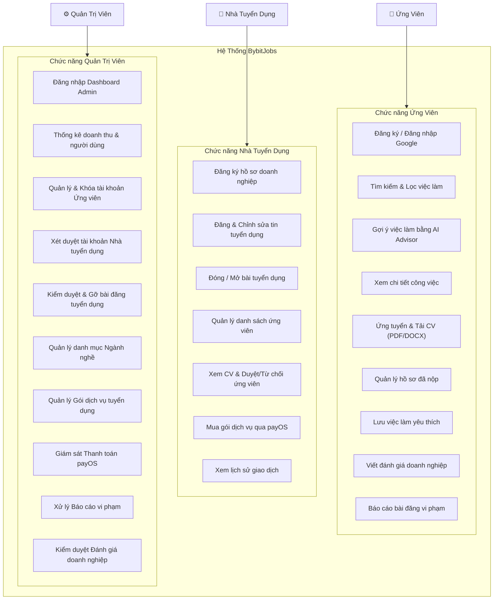
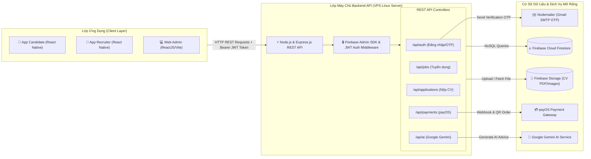
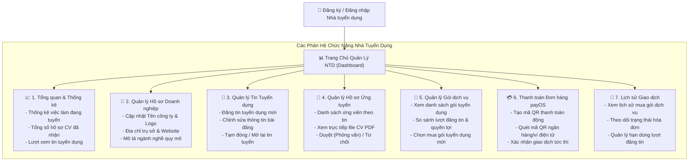
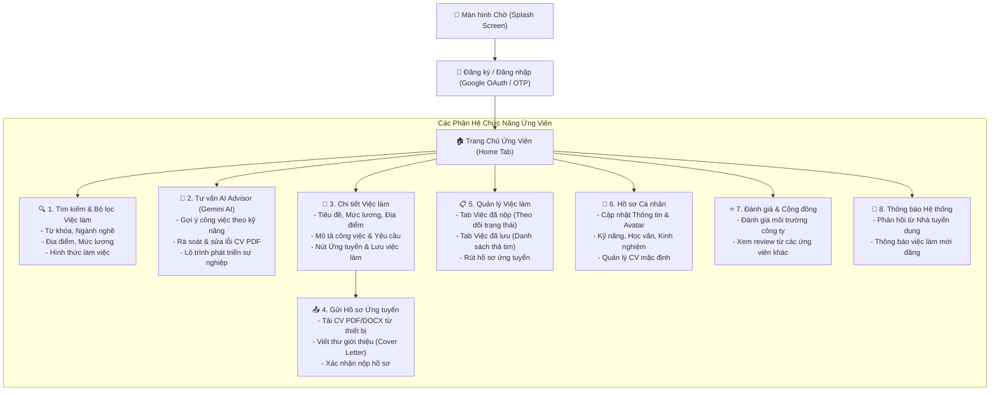
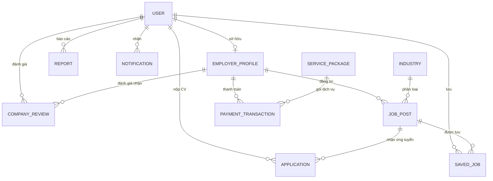

# BÁO CÁO TỐT NGHIỆP: XÂY DỰNG ỨNG DỤNG DI ĐỘNG TÌM KIẾM VIỆC LÀM - BYBITJOBS

**Giảng viên hướng dẫn:** Nguyễn Ngọc Chấn  
**Nhóm sinh viên thực hiện:**
1. Phạm Ngọc Thanh - PS44986 (Trưởng nhóm, PM, Backend)
2. Lê Hoàng Sang - PS44929 (Backend, Analysis)
3. Nguyễn Hoàng Đại - PS44930 (Backend, Functionalities)
4. Lê Thiện Nhân - PS45138 (Frontend, UI/UX)
5. Đoàn Nguyễn Anh Khoa - PS45005 (Frontend, UI/UX)

**Thời gian hoàn thành:** 03/07/2026  
**Đơn vị:** Trường Cao đẳng FPT Polytechnic TP. Hồ Chí Minh

---

# CHƯƠNG 1: GIỚI THIỆU DỰ ÁN

Thế kỷ 21 chứng kiến sự bùng nổ của công nghệ số, làm thay đổi sâu sắc mọi khía cạnh của đời sống xã hội. Trong đó, thị trường lao động và lĩnh vực tuyển dụng là một trong những mảng chịu tác động mạnh mẽ nhất. Sự phổ biến của điện thoại thông minh và mạng Internet đã trao quyền cho người dùng, cho phép các ứng viên chủ động tìm kiếm và kết nối với nhà tuyển dụng một cách nhanh chóng. 

Thực tế cho thấy thị trường nền tảng tìm kiếm việc làm tại Việt Nam tuy sôi động với nhiều thương hiệu lớn, nhưng phần nhiều lại đang tập trung vào nhóm người lao động đã dày dặn kinh nghiệm. Vẫn còn thiếu vắng những không gian thực sự tối ưu cho nhóm đối tượng học sinh, sinh viên – những người cần một công cụ có giao diện trực quan, thao tác ứng tuyển đơn giản và thuật toán gợi ý các công việc linh hoạt bằng AI, phù hợp với lịch học và kinh nghiệm hiện tại.

Xuất phát từ bối cảnh đó, dự án **"BybitJobs"** ra đời với mục tiêu ưu tiên hàng đầu là phục vụ đối tượng học sinh, sinh viên và người tìm việc trẻ, tạo đà để tiếp tục mở rộng hỗ trợ đa dạng các tệp người tìm việc khác trên thị trường.

---

# CHƯƠNG 2: KHẢO SÁT & YÊU CẦU HỆ THỐNG

## 2.1. Yêu cầu từ Khách hàng và Thị trường
1. **Tính tiện lợi và nhanh chóng:** Người dùng có thể tìm kiếm, lọc và ứng tuyển việc làm mọi lúc, mọi nơi chỉ với vài thao tác đơn giản trên thiết bị di động.
2. **Tính minh bạch thông tin:** Cung cấp đầy đủ và rõ ràng thông tin về công việc (mô tả, mức lương, yêu cầu, địa điểm, hình thức làm việc) và thông tin doanh nghiệp tuyển dụng.
3. **Khả năng gợi ý thông minh bằng AI:** Hỗ trợ công cụ gợi ý việc làm dựa trên kỹ năng, hồ sơ và xu hướng tìm kiếm của ứng viên qua Google Gemini AI.
4. **Tính an toàn và bảo mật:** Thông tin cá nhân, hồ sơ ứng tuyển và dữ liệu liên hệ của người dùng phải được bảo vệ, hạn chế rủi ro tin tuyển dụng lừa đảo qua cơ chế kiểm duyệt bài đăng nghiêm ngặt.

## 2.2. Đối tượng sử dụng
Hệ thống **BybitJobs** được thiết kế để phục vụ 3 nhóm đối tượng chính:
1. **Ứng viên (Candidate - App Mobile):** Tìm kiếm việc làm, xem thông tin công ty, tạo và tải CV (PDF/DOCX), ứng tuyển công việc, theo dõi trạng thái ứng tuyển, lưu việc làm yêu thích, tương tác với AI Advisor và đánh giá công ty.
2. **Nhà tuyển dụng (Recruiter - App Mobile & Web Partner):** Quản lý hồ sơ doanh nghiệp, đăng/chỉnh sửa tin tuyển dụng, mua gói dịch vụ tuyển dụng qua cổng payOS, quản lý danh sách ứng viên, xem CV và duyệt/từ chối hồ sơ.
3. **Quản trị viên (Admin - Web Admin):** Theo dõi chỉ số toàn hệ thống, quản lý tài khoản người dùng, xét duyệt doanh nghiệp, kiểm duyệt tin tuyển dụng, quản lý gói dịch vụ, quản lý ngành nghề, giám sát thanh toán/doanh thu, xử lý báo cáo vi phạm và kiểm duyệt đánh giá.

---

# CHƯƠNG 3: PHÂN TÍCH HỆ THỐNG

## 3.1. Mô hình triển khai hệ thống
- **BybitJobs Mobile App (React Native/Expo):** Phục vụ Ứng viên và Nhà tuyển dụng trên nền tảng Android & iOS.
- **BybitJobs Web Admin (ReactJS/Vite/TailwindCSS):** Trang quản trị vận hành dành cho Quản trị viên.
- **BybitJobs API Server (Node.js/Express.js):** RESTful Backend API kết nối Firebase Firestore, Google Gemini AI, cổng thanh toán payOS và Gmail SMTP.

## 3.2. Sơ đồ Use Case Hệ Thống

---

# CHƯƠNG 4: THIẾT KẾ ỨNG DỤNG (CHUẨN HÓA LẠI TOÀN BỘ)

## 4.1. Mô hình công nghệ và kiến trúc
Dự án được xây dựng dựa trên mô hình kiến trúc Client - Server với phân tách rõ ràng giữa giao diện (Client), máy chủ xử lý (Server API) và cơ sở dữ liệu (Database).

### Bảng 4.1: Mô hình công nghệ hệ thống (Technology Stack)

| Thành phần | Công nghệ sử dụng | Mô tả vai trò |
| :--- | :--- | :--- |
| **Server** | VPS (Ubuntu Server), Node.js, Express.js | Máy chủ ảo chạy Backend API xử lý trung gian |
| **Client Mobile** | React Native, TypeScript, Expo | Ứng dụng di động đa nền tảng (Android/iOS) dành cho **Ứng viên** và **Nhà tuyển dụng** |
| **Client Web Admin** | ReactJS, Vite, TailwindCSS, TypeScript | Trang web quản trị hệ thống **dành riêng cho Admin** |
| **Database & Storage** | Firebase (Cloud Firestore & Storage) | Cơ sở dữ liệu NoSQL đám mây & Lưu trữ tệp tin CV (PDF/DOCX), logo công ty |
| **Dịch vụ tích hợp** | Google Gemini AI, payOS SDK, Nodemailer | AI gợi ý việc làm & tư vấn CV, Cổng thanh toán quét mã QR, Email xác thực OTP |

### 4.1.1 Client-Side (Phía người dùng)
- **BybitJobs Mobile App (Dành cho Ứng viên & Nhà tuyển dụng):** Là ứng dụng di động đa nền tảng được phát triển trên nền tảng React Native (Expo Framework) kết hợp với TypeScript, đảm bảo khả năng vận hành tối ưu trên cả hai hệ điều hành Android và iOS. Ứng dụng chịu trách nhiệm cung cấp giao diện tương tác trực quan, hiển thị danh sách việc làm, thu thập dữ liệu người dùng (nộp hồ sơ CV, đăng tin tuyển dụng) và giao tiếp trực tiếp với hệ thống Backend API.
- **Trang quản trị Web Admin (Dành cho Quản trị viên):** Là hệ thống Web Dashboard dành riêng cho Admin, được xây dựng bằng công nghệ ReactJS, Vite và TailwindCSS. Phân hệ này cung cấp công cụ trực quan giúp Quản trị viên theo dõi các chỉ số thống kê hệ thống, kiểm duyệt nội dung bài đăng tuyển dụng, xác minh thông tin doanh nghiệp và quản lý toàn bộ dữ liệu người dùng.

### 4.1.2 Server-Side (Phía máy chủ)
- **Node.js:** Môi trường thực thi JavaScript phía máy chủ (Server-side runtime environment) theo cơ chế Event-driven và Non-blocking I/O, giúp xử lý đồng thời nhiều truy vấn với tốc độ phản hồi nhanh và khả năng mở rộng hệ thống cao.
- **Express.js:** Framework web tối giản và linh hoạt trên nền Node.js, cung cấp hệ thống định tuyến (Routing) mạnh mẽ và cơ chế Middleware xử lý các yêu cầu HTTP/HTTPS, giúp đơn giản hóa quá trình xây dựng kiến trúc RESTful API cho ứng dụng.
- **Firebase Authentication & JWT (JSON Web Token):** Giải pháp xác thực và phân quyền đa lớp. Hệ thống kết hợp dịch vụ xác thực của Firebase để định danh người dùng an toàn, đồng thời cấp mã Token mã hóa (JWT) chứa thông tin vai trò (`CANDIDATE`, `EMPLOYER`, `ADMIN`) để bảo mật các điểm cuối (Endpoints) của API.

### 4.1.3 Database-Side (Phía Cơ sở dữ liệu & Lưu trữ)
- **Firebase Cloud Firestore:** Là cơ sở dữ liệu NoSQL đám mây linh hoạt và có khả năng mở rộng cao, lưu trữ toàn bộ dữ liệu người dùng, bài đăng tuyển dụng, hồ sơ ứng tuyển, ngành nghề và lịch sử giao dịch dưới dạng các Documents/Collections với tốc độ truy vấn thời gian thực (Realtime).
- **Firebase Storage:** Dịch vụ lưu trữ tệp tin đám mây an toàn, phục vụ việc lưu trữ và phân phối các tệp CV (định dạng PDF/DOCX), ảnh đại diện đại diện ứng viên và logo nhận diện thương hiệu doanh nghiệp.

#### Sơ đồ Kiến trúc Phía Máy Chủ (Server-Side Architecture Diagram)

---

## 4.2. Thiết kế Cấu trúc Trang (Sitemap)

### 4.2.1 Sitemap Trang Quản Trị Viên (Web Admin)

  
*Hình 4.1: Sơ đồ Sitemap web quản lý*

```mermaid
flowchart TD
    AdminLogin["🔑 Màn hình Đăng nhập (Admin Login)"] --> AdminDashboard["💻 Trang Chủ Quản Trị (Dashboard)"]

    subgraph AdminModules ["Các Phân Hệ Quản Lý Vận Hành"]
        AdminDashboard --> DashboardStats["📊 1. Dashboard Tổng Quan\n- Doanh thu hệ thống\n- Thống kê Ứng viên & NTD\n- Số bài đăng tuyển dụng mới"]
        AdminDashboard --> UserMgmt["👥 2. Quản lý Ứng Viên\n- Danh sách Ứng viên\n- Chi tiết hồ sơ cá nhân\n- Khóa / Mở khóa tài khoản"]
        AdminDashboard --> EmpMgmt["🏢 3. Quản lý Nhà Tuyển Dụng\n- Danh sách Doanh nghiệp\n- Phê duyệt đơn đăng ký mới\n- Kiểm tra Giấy phép / MST"]
        AdminDashboard --> JobMgmt["📝 4. Quản lý Bài Đăng\n- Kiểm duyệt tin đăng mới\n- Lọc trạng thái (Chờ/Duyệt/Từ chối)\n- Gỡ bài vi phạm chính sách"]
        AdminDashboard --> PkgMgmt["💎 5. Quản lý Gói Dịch Vụ\n- Cấu hình giá gói tuyển dụng\n- Số lượt đăng tin & Thời hạn\n- Quản lý tính năng nổi bật"]
        AdminDashboard --> IndMgmt["📂 6. Quản lý Ngành Nghề\n- Thêm danh mục ngành nghề mới\n- Chỉnh sửa / Tạm ẩn ngành\n- Thống kê bài đăng theo ngành"]
        AdminDashboard --> PayMgmt["💳 7. Quản lý Thanh Toán\n- Lịch sử giao dịch payOS\n- Trạng thái đơn hàng (Thành công/Lỗi)\n- Báo cáo doanh thu theo tháng"]
        AdminDashboard --> RptMgmt["⚠️ 8. Quản lý Báo Cáo Vi Phạm\n- Tiếp nhận báo cáo lừa đảo\n- Xử lý gỡ bài / Cảnh báo\n- Khóa tài khoản vi phạm"]
        AdminDashboard --> RevMgmt["⭐ 9. Kiểm Duyệt Đánh Giá\n- Xem nhận xét công ty từ ứng viên\n- Duyệt / Ẩn bình luận không phù hợp"]
        AdminDashboard --> NotifMgmt["🔔 10. Quản lý Thông Báo\n- Gửi thông báo hệ thống\n- Phát thông báo theo UID cụ thể"]
    end
```

#### Mô tả chi tiết chức năng các trang trong Web Admin:
- **Đăng nhập (Login Admin):** Xác thực tài khoản quản trị viên cấp cao với mật khẩu và JWT token.
- **Dashboard Tổng quan:** Hiển thị 4 thẻ chỉ số cốt lõi (Tổng doanh thu, Tổng số người tìm việc, Số doanh nghiệp đối tác, Số bài đăng mới) cùng biểu đồ tăng trưởng doanh thu 7 ngày qua.
- **Quản lý Ứng viên:** Tra cứu danh sách 12.000+ ứng viên, lọc theo ngày đăng ký, khóa/mở khóa tài khoản ứng viên vi phạm quy định.
- **Quản lý Nhà tuyển dụng:** Kiểm tra thông tin pháp lý doanh nghiệp (Mã số thuế, Tên công ty, HR đại diện), ra quyết định "Phê duyệt" hoặc "Từ chối" tài khoản tuyển dụng mới.
- **Quản lý Bài đăng tuyển dụng:** Kiểm duyệt nội dung bài đăng tuyển dụng trước khi công khai lên ứng dụng di động, thực hiện "Gỡ bài" nếu có dấu hiệu lừa đảo.
- **Quản lý Gói dịch vụ:** Thiết lập danh mục các gói tuyển dụng (Basic, Standard, VIP), điều chỉnh đơn giá và quyền lợi đi kèm.
- **Quản lý Ngành nghề:** Chuẩn hóa dữ liệu các danh mục công việc (Công nghệ thông tin, Thiết kế, Marketing, Bán hàng...).
- **Quản lý Thanh toán:** Giám sát dòng tiền giao dịch mua gói dịch vụ từ các doanh nghiệp qua cổng thanh toán payOS.
- **Quản lý Báo cáo vi phạm:** Xử lý danh sách các báo cáo từ ứng viên đối với các bài đăng hoặc doanh nghiệp nghi ngờ lừa đảo.
- **Quản lý Đánh giá doanh nghiệp:** Phê duyệt hoặc ẩn các đánh giá, bình luận từ người tìm việc để đảm bảo tính khách quan.
- **Quản lý Thông báo:** Phát thông báo hàng loạt hoặc gửi thông báo cá nhân hóa tới thiết bị di động của người dùng.

### 4.2.2 Sitemap Trang Nhà Tuyển Dụng (Employer Mobile App / Web Partner)

  
*Hình 4.2: Sơ đồ Sitemap web đối tác*

#### Mô tả chi tiết chức năng các trang dành cho Nhà tuyển dụng:
- **Đăng ký / Đăng nhập NTD:** Điền thông tin doanh nghiệp (Tên công ty, Mã số thuế, Họ tên HR đại diện, SĐT), đăng gửi hồ sơ chờ Admin duyệt.
- **Tổng quan (Dashboard NTD):** Bảng điều khiển trung tâm hiển thị các chỉ số tuyển dụng cốt lõi: số vị trí đang mở tuyển, tổng số hồ sơ CV đã nhận được, tỷ lệ ứng tuyển và lượt xem tin.
- **Quản lý Hồ sơ Doanh nghiệp:** Cập nhật thông tin nhận diện thương hiệu tuyển dụng (Logo, Ảnh bìa, Mô tả công ty, Địa chỉ làm việc, Website).
- **Quản lý Tin Tuyển dụng:** Cho phép NTD khởi tạo bài đăng tuyển dụng mới (chọn Ngành nghề, Mức lương min-max, Địa điểm, Yêu cầu kinh nghiệm), chỉnh sửa nội dung hoặc tạm đóng/mở lại tin đăng.
- **Quản lý Hồ sơ Ứng tuyển:** Danh sách các ứng viên nộp CV cho từng công việc. NTD có thể bấm xem trực tiếp file CV dạng PDF ngay trên ứng dụng, đánh giá hồ sơ và chuyển trạng thái "Chấp nhận (Mời phỏng vấn)" hoặc "Từ chối" (hệ thống tự động phát thông báo kết quả cho ứng viên).
- **Quản lý Gói Dịch vụ & Thanh toán payOS:** NTD chọn mua gói dịch vụ tuyển dụng (Basic, Pro, VIP). Hệ thống hiển thị mã QR thanh toán động payOS. Sau khi quét mã thanh toán thành công, hệ thống tự động cộng số lượt đăng tin vào tài khoản doanh nghiệp.
- **Lịch sử Giao dịch:** Cho phép NTD tra cứu hóa đơn thanh toán, mã giao dịch, số tiền đã chi trả và thời hạn sử dụng lượt đăng tin.

### 4.2.3 Sitemap App Ứng Viên (Candidate Mobile App)

  
*Hình 4.3: Sơ đồ sitemap ứng dụng khách hàng*

#### Mô tả chi tiết chức năng các trang dành cho Ứng viên:
- **Màn hình Chờ (Splash Screen):** Màn hình khởi động ứng dụng hiển thị logo và thông điệp thương hiệu BybitJobs.
- **Đăng ký / Đăng nhập:** Đăng nhập nhanh 1-click qua tài khoản Google (Google Sign-In OAuth) hoặc mã OTP gửi qua Email.
- **Trang chủ (Home):** Nơi hiển thị các tin tuyển dụng mới nhất, bộ danh mục ngành nghề (CNTT, Thiết kế, Marketing...), thanh tìm kiếm nhanh và Widget AI Gợi ý công việc phù hợp với kỹ năng bản thân.
- **Tìm kiếm & Bộ lọc việc làm:** Tìm kiếm công việc theo từ khóa tên vị trí, lọc chi tiết theo tỉnh/thành phố, khoảng lương min-max, loại hình làm việc (Full-time, Part-time, Remote, Intern).
- **Chi tiết việc làm:** Hiển thị thông tin tổng quan công việc (Mức lương, Hạn nộp, Địa điểm), thông tin công ty, chi tiết mô tả công việc (JD), yêu cầu ứng viên, quyền lợi được hưởng và các nút thao tác "Ứng tuyển ngay", "Lưu việc làm".
- **Gửi hồ sơ ứng tuyển:** Giao diện cho phép ứng viên đính kèm tệp CV dạng PDF/DOCX có sẵn trên điện thoại, điền thư giới thiệu (Cover Letter) gửi tới nhà tuyển dụng và xác nhận nộp.
- **Quản lý việc làm (Đã nộp / Đã lưu):**
  - *Tab Việc đã nộp:* Theo dõi danh sách công việc đã ứng tuyển kèm trạng thái thời gian thực (`Chờ xử lý`, `Mời phỏng vấn`, `Từ chối`). Hỗ trợ nút "Rút hồ sơ" nếu không còn nhu cầu.
  - *Tab Việc đã lưu:* Quản lý các bài đăng việc làm đã thả tim để xem lại và ứng tuyển sau.
- **Tư vấn AI Advisor (Google Gemini AI):** Giao diện chat trực tuyến với trợ lý AI thông minh để nhận tư vấn định hướng công việc, gợi ý bổ sung kỹ năng và rà soát nội dung CV.
- **Hồ sơ cá nhân:** Cập nhật họ tên, ảnh đại diện, số điện thoại, ngày sinh, mục tiêu nghề nghiệp, kỹ năng chuyên môn, kinh nghiệm làm việc và tải lên bản CV mặc định.
- **Đánh giá doanh nghiệp & Thông báo:** Gửi đánh giá số sao (1-5 sao) kèm nhận xét về trải nghiệm phỏng vấn/làm việc tại các công ty; nhận thông báo đẩy tức thì khi nhà tuyển dụng xem hoặc duyệt hồ sơ.

---

## 4.3. Sơ đồ Quan hệ Thực thể & Chi tiết Thực thể CSDL (ERD)

### 4.3.1 Sơ đồ Quan hệ Thực thể (ERD Diagram)

---

### 4.3.2 Chi tiết 11 Thực thể Cơ sở Dữ liệu BybitJobs

#### 1. Thực thể `User` (Người dùng)
Bảng lưu trữ thông tin tài khoản người dùng chung trong hệ thống.

| Thuộc tính | Kiểu dữ liệu | Mô tả | Ràng buộc |
| :--- | :--- | :--- | :--- |
| `user_id` | String / UUID | Mã định danh duy nhất người dùng | PK, Not Null |
| `email` | String | Email đăng nhập / liên hệ | Unique, Not Null |
| `full_name` | String | Họ và tên người dùng | Not Null |
| `phone` | String | Số điện thoại liên lạc | Nullable |
| `avatar_url` | String | Đường dẫn ảnh đại diện | Nullable |
| `role` | String | Vai trò (`candidate`, `recruiter`, `admin`) | Default: `candidate` |
| `bio` | Text | Giới thiệu bản thân / Mục tiêu nghề nghiệp | Nullable |
| `skills` | Array / Text | Danh sách kỹ năng chuyên môn | Nullable |
| `is_active` | Boolean | Trạng thái tài khoản (True: Hoạt động, False: Khóa) | Default: True |
| `created_at` | Timestamp | Thời gian đăng ký tài khoản | Not Null |

#### 2. Thực thể `EmployerProfile` (Hồ sơ Doanh nghiệp / Nhà tuyển dụng)
Bảng thông tin chi tiết dành riêng cho tài khoản Nhà tuyển dụng.

| Thuộc tính | Kiểu dữ liệu | Mô tả | Ràng buộc |
| :--- | :--- | :--- | :--- |
| `company_id` | String / UUID | Mã định danh doanh nghiệp | PK, Not Null |
| `user_id` | String / UUID | Mã liên kết tài khoản sở hữu | FK -> User.user_id |
| `company_name` | String | Tên công ty / doanh nghiệp | Not Null |
| `tax_code` | String | Mã số thuế doanh nghiệp | Nullable |
| `hr_name` | String | Họ tên nhân viên HR phụ trách | Not Null |
| `hr_phone` | String | Số điện thoại liên hệ HR | Not Null |
| `logo_url` | String | Logo doanh nghiệp | Nullable |
| `address` | String | Địa chỉ trụ sở công ty | Not Null |
| `website` | String | Địa chỉ website công ty | Nullable |
| `description` | Text | Mô tả quy mô, ngành nghề hoạt động | Nullable |
| `posting_limit` | Int | Số lượt đăng tin tuyển dụng còn lại | Default: 0 |
| `status` | String | Trạng thái duyệt (`pending`, `approved`, `rejected`) | Default: `pending` |

#### 3. Thực thể `JobPost` (Bài đăng tuyển dụng)
Bảng lưu trữ chi tiết tin tuyển dụng việc làm.

| Thuộc tính | Kiểu dữ liệu | Mô tả | Ràng buộc |
| :--- | :--- | :--- | :--- |
| `job_id` | String / UUID | Mã định danh bài đăng tuyển dụng | PK, Not Null |
| `company_id` | String / UUID | Mã doanh nghiệp đăng tin | FK -> EmployerProfile |
| `industry_id` | String / UUID | Mã ngành nghề phân loại | FK -> Industry |
| `title` | String | Tiêu đề vị trí tuyển dụng | Not Null |
| `location` | String | Địa điểm làm việc (Tỉnh/Thành phố) | Not Null |
| `salary_min` | Decimal / Int | Mức lương tối thiểu | Not Null |
| `salary_max` | Decimal / Int | Mức lương tối đa | Not Null |
| `job_type` | String | Hình thức (`Full-time`, `Part-time`, `Remote`, `Intern`) | Not Null |
| `experience` | String | Yêu cầu kinh nghiệm (`Không yêu cầu`, `1 năm`...) | Not Null |
| `description` | Text | Mô tả chi tiết công việc | Not Null |
| `requirements` | Text | Yêu cầu đối với ứng viên | Not Null |
| `benefits` | Text | Quyền lợi & Chế độ đãi ngộ | Nullable |
| `deadline` | Timestamp | Hạn nộp hồ sơ ứng tuyển | Not Null |
| `status` | String | Trạng thái tin (`pending`, `active`, `rejected`, `closed`) | Default: `pending` |
| `created_at` | Timestamp | Ngày tạo bài đăng | Not Null |

#### 4. Thực thể `Industry` (Ngành nghề)
Bảng quản lý danh mục ngành nghề việc làm.

| Thuộc tính | Kiểu dữ liệu | Mô tả | Ràng buộc |
| :--- | :--- | :--- | :--- |
| `industry_id` | String / UUID | Mã ngành nghề | PK, Not Null |
| `name` | String | Tên ngành nghề (CNTT, Thiết kế, Marketing...) | Not Null, Unique |
| `icon_url` | String | Biểu tượng icon ngành nghề | Nullable |
| `is_active` | Boolean | Trạng thái hiển thị (True / False) | Default: True |
| `job_count` | Int | Số bài đăng thuộc ngành nghề này | Default: 0 |

#### 5. Thực thể `Application` (Hồ sơ ứng tuyển)
Bảng ghi nhận lượt nộp hồ sơ CV của ứng viên vào vị trí tuyển dụng.

| Thuộc tính | Kiểu dữ liệu | Mô tả | Ràng buộc |
| :--- | :--- | :--- | :--- |
| `application_id` | String / UUID | Mã đơn ứng tuyển | PK, Not Null |
| `job_id` | String / UUID | Mã bài đăng tuyển dụng | FK -> JobPost |
| `candidate_id` | String / UUID | Mã tài khoản ứng viên nộp | FK -> User |
| `cv_url` | String | Đường dẫn tệp CV (PDF/DOCX) | Not Null |
| `cover_letter` | Text | Thư giới thiệu bản thân | Nullable |
| `status` | String | Trạng thái (`pending`, `shortlisted`, `rejected`, `hired`) | Default: `pending` |
| `applied_at` | Timestamp | Thời điểm nộp hồ sơ | Not Null |

#### 6. Thực thể `ServicePackage` (Gói dịch vụ tuyển dụng)
Bảng các gói dịch vụ dành cho Nhà tuyển dụng mua để đăng tin.

| Thuộc tính | Kiểu dữ liệu | Mô tả | Ràng buộc |
| :--- | :--- | :--- | :--- |
| `package_id` | String / UUID | Mã gói dịch vụ | PK, Not Null |
| `name` | String | Tên gói (Basic, Standard, Premium, VIP) | Not Null |
| `price` | Decimal | Chi phí gói (VND) | Not Null |
| `duration_days` | Int | Thời hạn sử dụng (Số ngày) | Not Null |
| `posting_limit` | Int | Số bài đăng tuyển dụng được cấp | Not Null |
| `description` | Text | Mô tả quyền lợi đi kèm gói | Nullable |
| `is_active` | Boolean | Trạng thái mở bán gói | Default: True |

#### 7. Thực thể `PaymentTransaction` (Giao dịch thanh toán)
Bảng lịch sử thanh toán qua cổng payOS.

| Thuộc tính | Kiểu dữ liệu | Mô tả | Ràng buộc |
| :--- | :--- | :--- | :--- |
| `transaction_id` | String | Mã giao dịch payOS / Hệ thống | PK, Not Null |
| `company_id` | String / UUID | Mã nhà tuyển dụng thanh toán | FK -> EmployerProfile |
| `package_id` | String / UUID | Mã gói dịch vụ chọn mua | FK -> ServicePackage |
| `amount` | Decimal | Số tiền giao dịch | Not Null |
| `payment_gateway` | String | Cổng thanh toán (`payOS`, `Bank Transfer`) | Not Null |
| `status` | String | Trạng thái (`pending`, `succeeded`, `failed`) | Default: `pending` |
| `paid_at` | Timestamp | Thời điểm thanh toán thành công | Nullable |

#### 8. Thực thể `CompanyReview` (Đánh giá công ty)
Bảng nhận xét và đánh giá sao doanh nghiệp từ ứng viên.

| Thuộc tính | Kiểu dữ liệu | Mô tả | Ràng buộc |
| :--- | :--- | :--- | :--- |
| `review_id` | String / UUID | Mã nhận xét đánh giá | PK, Not Null |
| `company_id` | String / UUID | Mã doanh nghiệp được đánh giá | FK -> EmployerProfile |
| `candidate_id` | String / UUID | Mã ứng viên viết đánh giá | FK -> User |
| `rating` | Int | Số sao đánh giá (1 đến 5 sao) | Check (1 <= rating <= 5) |
| `comment` | Text | Nội dung nhận xét chi tiết | Not Null |
| `is_approved` | Boolean | Trạng thái duyệt của Admin | Default: False |
| `created_at` | Timestamp | Thời điểm gửi đánh giá | Not Null |

#### 9. Thực thể `Report` (Báo cáo vi phạm)
Bảng lưu vết báo cáo vi phạm bài đăng tuyển dụng hoặc doanh nghiệp.

| Thuộc tính | Kiểu dữ liệu | Mô tả | Ràng buộc |
| :--- | :--- | :--- | :--- |
| `report_id` | String / UUID | Mã bản ghi báo cáo | PK, Not Null |
| `target_id` | String / UUID | Mã bài đăng hoặc mã doanh nghiệp bị báo cáo | Not Null |
| `target_type` | String | Loại đối tượng (`job_post`, `company`) | Not Null |
| `reporter_id` | String / UUID | Mã người dùng gửi báo cáo | FK -> User |
| `reason` | Text | Lý do báo cáo (Lừa đảo, Thông tin sai sự thật...) | Not Null |
| `status` | String | Trạng thái xử lý (`pending`, `resolved`, `dismissed`) | Default: `pending` |
| `created_at` | Timestamp | Thời gian gửi báo cáo | Not Null |

#### 10. Thực thể `Notification` (Thông báo)
Bảng thông báo hệ thống gửi tới người dùng.

| Thuộc tính | Kiểu dữ liệu | Mô tả | Ràng buộc |
| :--- | :--- | :--- | :--- |
| `notification_id` | String / UUID | Mã thông báo | PK, Not Null |
| `user_id` | String / UUID | Mã người dùng nhận thông báo | FK -> User |
| `title` | String | Tiêu đề thông báo | Not Null |
| `body` | Text | Nội dung chi tiết thông báo | Not Null |
| `type` | String | Phân loại (`application_update`, `job_alert`, `system`) | Not Null |
| `is_read` | Boolean | Trạng thái đã đọc | Default: False |
| `created_at` | Timestamp | Thời gian phát thông báo | Not Null |

#### 11. Thực thể `SavedJob` & `SearchHistory` (Việc làm đã lưu & Lịch sử tìm kiếm)
Bảng lưu trữ các bài đăng yêu thích và từ khóa tìm kiếm gần đây.

| Thuộc tính | Kiểu dữ liệu | Mô tả | Ràng buộc |
| :--- | :--- | :--- | :--- |
| `saved_id` | String / UUID | Mã bản ghi lưu công việc | PK, Not Null |
| `candidate_id` | String / UUID | Mã ứng viên lưu bài đăng | FK -> User |
| `job_id` | String / UUID | Mã bài đăng việc làm được lưu | FK -> JobPost |
| `saved_at` | Timestamp | Thời điểm lưu việc làm | Not Null |

---

# CHƯƠNG 5: THỰC HIỆN GIAO DIỆN VÀ CHỨC NĂNG HỆ THỐNG

Hệ thống **BybitJobs** đã hoàn thiện giao diện lập trình cho cả 3 phân hệ chính:

## 5.1 Giao diện App Ứng viên (Candidate Mobile App)

Ứng dụng di động **BybitJobs** được thiết kế giao diện đồng bộ theo **Tone màu chủ đạo Xanh Dương (Royal Blue - mã `#2563EB`)**, tạo cảm giác hiện đại, tin cậy, chuyên nghiệp và tối ưu trải nghiệm tương tác của ứng viên & nhà tuyển dụng:

- **5.1.1 Màn hình Splash / Màn hình chờ:** Hiển thị nhận diện thương hiệu BybitJobs với logo và sắc xanh dương chủ đạo khi vừa khởi chạy ứng dụng.
- **5.1.2 Màn hình Đăng ký / Đăng nhập:** Hỗ trợ đăng nhập nhanh bằng tài khoản Google (OAuth 2.0) và khôi phục mật khẩu qua Email OTP.
- **5.1.3 Màn hình Trang chủ (Home):** Hiển thị ô tìm kiếm việc làm, banner sự kiện tuyển dụng, danh mục ngành nghề nổi bật và danh sách bài đăng việc làm theo thời gian thực.
- **5.1.4 Màn hình Tư vấn AI Advisor:** Tích hợp Google Gemini AI cho phép ứng viên trò chuyện, đặt câu hỏi về định hướng nghề nghiệp và yêu cầu AI rà soát CV.
- **5.1.5 Màn hình Chi tiết công việc:** Hiển thị mức lương, loại hình công việc, thông tin công ty tuyển dụng, yêu cầu kỹ năng và các nút bấm "Ứng tuyển ngay", "Lưu việc làm".
- **5.1.6 Màn hình Ứng tuyển & Tải CV:** Cho phép chọn tệp CV dạng PDF/DOCX có sẵn trên thiết bị di động, viết thư giới thiệu (Cover Letter) và gửi hồ sơ.
- **5.1.7 Màn hình Quản lý việc làm (Đã nộp / Đã lưu):** Theo dõi lịch sử nộp CV kèm trạng thái kết quả (Chờ xử lý / Được mời phỏng vấn / Bị từ chối) và danh sách việc làm đã thả tim.
- **5.1.8 Màn hình Thông báo & Hồ sơ cá nhân:** Cập nhật thông tin bản thân, kinh nghiệm, kỹ năng và nhận thông báo biến động hồ sơ.

## 5.2 Giao diện Nhà tuyển dụng (Employer CMS & App)
- **5.2.1 Màn hình Đăng ký Doanh nghiệp:** Điền tên công ty, mã số thuế, thông tin người đại diện HR và tải logo doanh nghiệp.
- **5.2.2 Màn hình Trang chủ NTD:** Thống kê tổng quan số tin tuyển dụng đang chạy, lượt nộp CV và lượt xem tin.
- **5.2.3 Màn hình Đăng / Chỉnh sửa tin tuyển dụng:** Nhập vị trí công việc, ngành nghề, mức lương min-max, thời hạn nộp và yêu cầu chi tiết.
- **5.2.4 Màn hình Quản lý danh sách ứng viên:** Xem danh sách ứng viên đã nộp cho từng bài đăng tuyển dụng, xem trực tiếp file CV PDF ngay trên app.
- **5.2.5 Màn hình Xét duyệt hồ sơ CV:** Cập nhật chuyển trạng thái hồ sơ ứng viên (Duyệt / Từ chối), hệ thống tự động gửi thông báo đến ứng viên.
- **5.2.6 Màn hình Mua gói dịch vụ tuyển dụng:** Chọn các gói dịch vụ (Basic, Standard, VIP), hiển thị chi tiết số lượt đăng tin đi kèm.
- **5.2.7 Màn hình Thanh toán payOS:** Tạo mã QR thanh toán động qua ngân hàng/Ví điện tử, xác thực giao dịch tức thì và cấp lượt đăng tin mới.

## 5.3 Giao diện Web Quản trị (Web Admin)
- **5.3.1 Màn hình Đăng nhập Admin:** Xác thực tài khoản Quản trị viên cấp cao.
- **5.3.2 Màn hình Dashboard Tổng quan:** Thống kê tổng doanh thu toàn hệ thống, tổng số người tìm việc, số doanh nghiệp đối tác và biểu đồ doanh thu theo thời gian.
- **5.3.3 Màn hình Quản lý Ứng viên:** Tìm kiếm ứng viên, theo dõi trạng thái tài khoản và thực hiện khóa/mở khóa tài khoản vi phạm.
- **5.3.4 Màn hình Quản lý Nhà tuyển dụng:** Kiểm tra giấy phép/MST doanh nghiệp mới đăng ký, phê duyệt tài khoản NTD lên hệ thống.
- **5.3.5 Màn hình Quản lý Bài đăng tuyển dụng:** Danh sách các bài đăng tuyển dụng chờ kiểm duyệt, thực hiện "Duyệt tin" hoặc "Gỡ bài đăng" vi phạm chính sách.
- **5.3.6 Màn hình Quản lý Gói dịch vụ:** Cấu hình giá bán, số lượt đăng tin và thời hạn các gói tuyển dụng.
- **5.3.7 Màn hình Quản lý Ngành nghề:** Thêm mới, chỉnh sửa hoặc tạm ẩn danh mục ngành nghề việc làm.
- **5.3.8 Màn hình Quản lý Thanh toán:** Lịch sử chi tiết các giao dịch mua gói dịch vụ từ NTD qua payOS.
- **5.3.9 Màn hình Quản lý Báo cáo vi phạm:** Tiếp nhận và xử lý báo cáo tin tuyển dụng lừa đảo từ người dùng.
- **5.3.10 Màn hình Kiểm duyệt Đánh giá:** Duyệt hoặc ẩn các bình luận nhận xét về doanh nghiệp.
- **5.3.11 Màn hình Quản lý Thông báo:** Phát thông báo hàng loạt đến toàn bộ người dùng hệ thống.

---

# CHƯƠNG 6: KIỂM THỬ HỆ THỐNG (TEST CASES CHUẨN HÓA CẢ 3 VAI TRÒ)

Hệ thống **BybitJobs** đã được kiểm thử toàn diện trên cả 3 vai trò người dùng: **Ứng viên (Candidate)**, **Nhà tuyển dụng (Recruiter)** và **Quản trị viên (Admin)**. Các kịch bản kiểm thử được thiết kế bao phủ đầy đủ các trường hợp hợp lệ (Happy Path), trường hợp không hợp lệ (Negative Testing), kiểm thử giá trị biên (Boundary Testing) và xử lý lỗi hệ thống/ngoại lệ (System Exception & Timeout Testing).

---

## 6.1. Test Cases dành cho Vai trò Ứng viên (Candidate - App User)

| TC ID | Test case title | Expected result | Actual result | Runtype (Manual/Auto) | Tested by | Date started | Test details | Note |
| :--- | :--- | :--- | :--- | :--- | :--- | :--- | :--- | :--- |
| **TC_AU_AUTH_01** | UI Check - Màn hình Đăng ký / Đăng nhập | Giao diện hiển thị đúng thiết kế: logo BybitJobs, thông điệp chào mừng ("Tìm việc làm nhanh chóng") và nút "Tiếp tục với Google". | Hiển thị đúng thiết kế và màu sắc chuẩn | Manual | Nhân, Khoa | 25/07/26 | 1. Mở ứng dụng di động. 2. Điều hướng đến màn hình Đăng ký/Đăng nhập. 3. Quan sát các thành phần UI. | **PASS** |
| **TC_AU_AUTH_02** | Functional Check - Đăng nhập bằng Google (Happy Path) | Ứng dụng mở popup chọn tài khoản Google. Chọn tài khoản thành công, nhận Firebase Token và điều hướng đến màn hình "Hoàn tất thông tin". | Đã điều hướng đến màn hình Hoàn tất đăng ký thành công. | Manual | Nhân, Khoa | 25/07/26 | 1. Bấm nút "Tiếp tục với Google". 2. Chọn 1 tài khoản Google hợp lệ. | **PASS** |
| **TC_AU_AUTH_03** | Kiểm tra hiển thị màn hình Hoàn tất đăng ký | Giao diện hiển thị đầy đủ các trường: Ảnh đại diện, Họ tên, Email, SĐT, Ngày sinh, Giới tính, Vị trí mong muốn. Trường Email tự điền từ Google và bị vô hiệu hóa chỉnh sửa. | Hiển thị đầy đủ thông tin, trường Email bị vô hiệu hóa chỉnh sửa chuẩn xác. | Manual | Nhân, Khoa | 25/07/26 | 1. Hoàn thành bước đăng nhập Google. 2. Điều hướng đến màn hình Hoàn tất đăng ký. 3. Kiểm tra khóa trường Email. | **PASS** |
| **TC_AU_AUTH_04** | Cập nhật thông tin cá nhân bắt buộc (Happy Path) | Hệ thống lưu thông tin vào bảng `nguoi_dung`, hiển thị thông báo thành công và chuyển sang Trang chủ. | Lưu thông tin thành công và chuyển về Trang chủ. | Manual | Nhân, Khoa | 26/07/26 | 1. Nhập Họ tên "Nguyễn Văn A", SĐT "0912345678". 2. Bấm "Xác nhận/Hoàn tất". | **PASS** |
| **TC_AU_AUTH_05** | Cập nhật thông tin thất bại khi bỏ trống trường bắt buộc | Hệ thống báo lỗi ngay tại trường bị thiếu ("Họ tên / SĐT không được để trống") và giữ nguyên màn hình, không lưu dữ liệu. | Báo lỗi đúng trường thông tin thiếu và giữ nguyên màn hình. | Manual | Nhân, Khoa | 26/07/26 | 1. Bỏ trống trường "Số điện thoại" hoặc "Họ tên". 2. Bấm nút "Xác nhận/Hoàn tất". | **PASS** |
| **TC_AU_AUTH_06** | Kiểm tra giá trị biên - Độ dài Số điện thoại đúng 10 chữ số (Biên chuẩn) | Hệ thống chấp nhận SĐT đúng 10 chữ số (ví dụ: `0912345678`) và lưu thành công. | Nhập 10 chữ số hợp lệ và lưu dữ liệu thành công. | Manual | Nhân, Khoa | 26/07/26 | 1. Nhập Số điện thoại `0912345678`. 2. Bấm "Xác nhận/Hoàn tất". | **PASS** |
| **TC_AU_AUTH_07** | Kiểm tra giá trị biên - Độ dài Số điện thoại 9 chữ số (Dưới biên) hoặc 11 chữ số (Vượt biên) | Hệ thống báo lỗi "Số điện thoại phải bao gồm đúng 10 chữ số" và ngăn gửi form. | Hiển thị thông báo lỗi chính xác khi nhập 9 hoặc 11 chữ số. | Manual | Nhân, Khoa | 26/07/26 | 1. Nhập SĐT 9 số (`091234567`) hoặc 11 số (`09123456789`). 2. Bấm "Hoàn tất". | **PASS** |
| **TC_AU_AUTH_08** | Kiểm tra định dạng Số điện thoại không hợp lệ (Chứa chữ/ký tự đặc biệt) | Hệ thống hiển thị thông báo lỗi "Số điện thoại không đúng định dạng" và chặn gửi form. | Hiển thị thông báo lỗi định dạng SĐT. | Manual | Nhân, Khoa | 26/07/26 | 1. Nhập SĐT `0912abc#$`. 2. Bấm nút "Xác nhận/Hoàn tất". | **PASS** |
| **TC_AU_AUTH_09** | Đăng xuất khỏi ứng dụng | Hệ thống xóa Token đăng nhập (Session/JWT) và điều hướng về màn hình Đăng ký/Đăng nhập. | Đã đăng xuất thành công và quay lại màn hình Đăng nhập. | Manual | Nhân, Khoa | 26/07/26 | 1. Tại trang Cá nhân, bấm "Đăng xuất". 2. Xác nhận trên popup cảnh báo. | **PASS** |
| **TC_AU_JOB_01** | Kiểm tra hiển thị màn hình Trang chủ (Home Job List) | Hiển thị danh sách tin tuyển dụng, thanh tìm kiếm, bộ lọc, danh mục ngành nghề và danh sách việc làm nổi bật. | Hiển thị đầy đủ danh sách job và các thành phần giao diện. | Manual | Đại, Sang | 27/07/26 | 1. Đăng nhập thành công vào ứng dụng. 2. Quan sát màn hình Trang chủ. | **PASS** |
| **TC_AU_JOB_02** | Tìm kiếm việc làm theo từ khóa (Happy Path) | Hệ thống trả về danh sách công việc có tiêu đề (`tieu_de`) hoặc tên công ty chứa từ khóa tìm kiếm. | Danh sách hiển thị đúng các job chứa từ khóa "React Native". | Manual | Thanh, Đại | 28/07/26 | 1. Nhập từ khóa "React Native" vào thanh tìm kiếm. 2. Bấm phím Tìm kiếm/Icon kính lúp. | **PASS** |
| **TC_AU_JOB_03** | Tìm kiếm với từ khóa không tồn tại | Hệ thống hiển thị giao diện trống kèm thông báo "Không tìm thấy việc làm phù hợp". | Hiển thị đúng thông báo không tìm thấy kết quả. | Manual | Thanh, Đại | 28/07/26 | 1. Nhập chuỗi từ khóa vô nghĩa "xyz12345". 2. Bấm phím Tìm kiếm. | **PASS** |
| **TC_AU_JOB_04** | Tìm kiếm với từ khóa chứa ký tự đặc biệt / SQL Injection / Script | Hệ thống tự động mã hóa/trim ký tự đặc biệt và trả về kết quả an toàn không bị crash app hay lộ lỗi CSDL. | Hệ thống xử lý chuỗi an toàn, không báo lỗi nghẽn. | Manual | Thanh, Đại | 28/07/26 | 1. Nhập từ khóa `' OR 1=1 --` hoặc ``. 2. Bấm Tìm kiếm. | **PASS** |
| **TC_AU_JOB_05** | Lọc việc làm kết hợp Địa điểm và Mức lương (Happy Path) | Danh sách chỉ hiển thị các job thỏa mãn đồng thời tiêu chí địa điểm (`dia_chi`) và khoảng lương (`luong_toi_thieu`, `luong_toi_da`). | Hiển thị đúng danh sách công việc theo bộ lọc. | Manual | Thanh, Đại | 29/07/26 | 1. Nhấp vào nút "Bộ lọc". 2. Chọn Địa điểm (TP.HCM) và Khoảng lương (10-20 triệu). 3. Bấm "Áp dụng". | **PASS** |
| **TC_AU_JOB_06** | Xem chi tiết tin tuyển dụng | Màn hình hiển thị đầy đủ chi tiết job: Tên công ty, Logo, Mức lương, Mô tả công việc, Yêu cầu, Hạn nộp và nút "Ứng tuyển ngay". | Hiển thị chính xác thông tin chi tiết bài đăng. | Manual | Thanh, Đại | 29/07/26 | 1. Bấm vào một thẻ việc làm bất kỳ trên danh sách. 2. Kiểm tra thông tin hiển thị. | **PASS** |
| **TC_AU_APP_01** | Tải lên file CV mới dung lượng hợp lệ (< 5MB) (Happy Path) | Hệ thống tải file PDF/Word thành công, cập nhật thông tin vào bảng `cv` và hiển thị preview file. | File CV được upload thành công và hiển thị trong danh sách. | Manual | Nhân, Sang | 30/07/26 | 1. Vào Quản lý CV > Bấm "Tải lên CV". 2. Chọn file `.pdf` dung lượng 2.5MB. | **PASS** |
| **TC_AU_APP_02** | Tải lên file CV vượt dung lượng biên (> 5MB) | Hệ thống chặn không cho gửi file và hiển thị thông báo lỗi "Dung lượng tệp CV vượt quá giới hạn tối đa 5MB". | Hiển thị thông báo lỗi dung lượng file chính xác. | Manual | Nhân, Sang | 30/07/26 | 1. Chọn tải lên tệp CV `.pdf` dung lượng 8.5MB. 2. Nhấn Xác nhận. | **PASS** |
| **TC_AU_APP_03** | Tải lên file CV sai định dạng không hỗ trợ (.png / .exe / .zip) | Hệ thống từ chối tệp và báo lỗi "Định dạng file không hợp lệ, chỉ chấp nhận tệp .pdf hoặc .docx". | Hiển thị thông báo lỗi định dạng file không hỗ trợ. | Manual | Nhân, Sang | 30/07/26 | 1. Chọn file hình ảnh `.png` hoặc file thực thi `.exe`. 2. Nhấn Tải lên. | **PASS** |
| **TC_AU_APP_04** | Ứng tuyển công việc thành công (Happy Path) | Màn hình hiển thị "Ứng tuyển thành công", hệ thống tạo bản ghi mới trong bảng `ung_tuyen` và đổi nút sang "Đã ứng tuyển". | Ứng tuyển thành công, trạng thái nút bấm thay đổi. | Manual | Nhân, Sang | 31/07/26 | 1. Tại chi tiết job, nhấn "Ứng tuyển ngay". 2. Chọn file CV có sẵn, nhập Cover Letter > Nhấn "Gửi hồ sơ". | **PASS** |
| **TC_AU_APP_05** | Ứng tuyển khi chưa chọn / chưa có CV | Hệ thống báo lỗi "Vui lòng chọn hoặc tải lên CV trước khi ứng tuyển" và mở popup gợi ý tải CV. | Hiển thị cảnh báo chưa chọn CV và gợi ý giao diện upload. | Manual | Nhân, Sang | 31/07/26 | 1. Tại màn hình chi tiết job, nhấn "Ứng tuyển ngay". 2. Để trống tùy chọn CV > Nhấn "Gửi hồ sơ". | **PASS** |
| **TC_AU_APP_06** | Thử ứng tuyển trùng lặp 2 lần vào cùng 1 bài đăng | Hệ thống nhận biết bài đăng đã được nộp hồ sơ trước đó, đổi nút thành "Đã ứng tuyển" và ngăn bấm nộp lại. | Nút chuyển sang "Đã ứng tuyển", không cho nộp trùng. | Manual | Nhân, Sang | 31/07/26 | 1. Vào lại bài đăng đã nộp thành công ở TC_AU_APP_04. 2. Bấm thử nút ứng tuyển. | **PASS** |
| **TC_AU_APP_07** | Kiểm tra Danh sách công việc đã ứng tuyển | Hiển thị đầy đủ danh sách các job đã nộp hồ sơ cùng trạng thái ứng tuyển ("Đã gửi", "Đã xem", "Mời phỏng vấn", "Từ chối"). | Màn hình hiển thị chính xác lịch sử ứng tuyển và trạng thái tương ứng. | Manual | Nhân, Sang | 01/08/26 | 1. Vào mục "Cá nhân" > Chọn "Việc làm đã ứng tuyển". 2. Đối chiếu dữ liệu thực tế. | **PASS** |
| **TC_AU_AI_01** | Hỏi đáp tư vấn lộ trình nghề nghiệp với AI Advisor (Google Gemini) | Hệ thống chuyển câu hỏi đến Google Gemini API và trả về nội dung tư vấn lộ trình phù hợp, mượt mà. | AI trả lời thông tin chính xác, giao diện hiển thị câu trả lời rõ ràng. | Manual | Đại, Khoa | 01/08/26 | 1. Mở tab "AI Advisor". 2. Nhập câu hỏi "Tôi muốn làm React Native Dev thì học gì?". 3. Bấm Gửi. | **PASS** |
| **TC_AU_AI_02** | Xử lý lỗi khi dịch vụ AI bị gián đoạn mạng hoặc Timeout | Hệ thống không làm đơ ứng dụng, hiển thị thông báo lỗi "Không thể kết nối với trợ lý AI, vui lòng thử lại sau". | Hiển thị thông báo lỗi mượt mà, không crash ứng dụng. | Manual | Đại, Khoa | 01/08/26 | 1. Tắt kết nối mạng/mô phỏng API Gemini timeout. 2. Gửi câu hỏi cho AI Advisor. | **PASS** |
| **TC_AU_FAV_01** | Lưu công việc yêu thích | Hệ thống lưu công việc vào bảng `viec_lam_da_luu`, đổi icon trái tim sang trạng thái "Đã lưu". | Công việc được thêm vào danh sách đã lưu thành công. | Manual | Khoa, Sang | 02/08/26 | 1. Tại chi tiết việc làm, bấm chọn icon Trái tim. 2. Kiểm tra danh sách "Việc làm đã lưu". | **PASS** |
| **TC_AU_FAV_02** | Xem và Bỏ lưu công việc yêu thích | Màn hình hiển thị đúng danh sách việc làm đã thả tim. Khi bấm bỏ trái tim, công việc được xóa ngay khỏi danh sách. | Cập nhật xóa công việc khỏi danh sách lưu tức thì. | Manual | Khoa, Sang | 02/08/26 | 1. Vào Hồ sơ > "Việc làm đã lưu". 2. Bấm bỏ icon Trái tim tại 1 job. | **PASS** |
| **TC_AU_REV_01** | Viết đánh giá Doanh nghiệp 5 sao kèm nhận xét hợp lệ | Hệ thống lưu đánh giá vào bảng `CompanyReview` với trạng thái `is_approved = false` chờ Admin duyệt. | Lưu bài đánh giá thành công và hiển thị thông báo chờ duyệt. | Manual | Sang, Đại | 02/08/26 | 1. Vào trang chi tiết Công ty > Chọn "Đánh giá". 2. Chọn 5 sao, nhập bình luận 50 từ > Bấm Gửi. | **PASS** |
| **TC_AU_REV_02** | Viết đánh giá thất bại khi chưa chọn số sao hoặc nhận xét quá ngắn | Hệ thống báo lỗi "Vui lòng chọn số sao đánh giá và nhập nhận xét tối thiểu 10 ký tự". | Hiển thị cảnh báo lỗi đúng trường thông tin thiếu. | Manual | Sang, Đại | 02/08/26 | 1. Bỏ chọn số sao hoặc nhập nhận xét `123`. 2. Bấm Gửi đánh giá. | **PASS** |
| **TC_AU_REP_01** | Báo cáo bài đăng vi phạm / lừa đảo | Hệ thống ghi nhận bản ghi vào bảng `Report`, gửi cảnh báo lên trang Quản trị Admin. | Báo cáo vi phạm được gửi đi thành công. | Manual | Sang, Đại | 02/08/26 | 1. Tại bài đăng việc làm, chọn "Báo cáo vi phạm". 2. Chọn lý do "Thông tin sai sự thật" > Bấm Gửi. | **PASS** |
| **TC_AU_NOTI_01** | Kiểm tra danh sách thông báo và Đánh giá thông báo là đã đọc | Hiển thị danh sách thông báo từ bảng `thong_bao`. Khi bấm đọc, trạng thái `da_doc` chuyển sang `true` và ẩn chấm đỏ. | Hiển thị đúng danh sách thông báo và cập nhật trạng thái đã đọc. | Manual | Khoa, Sang | 02/08/26 | 1. Nhấn icon "Thông báo" trên thanh điều hướng. 2. Bấm nhấp vào 1 thông báo chưa đọc. | **PASS** |

---

## 6.2. Test Cases dành cho Vai trò Nhà Tuyển Dụng (Recruiter / Employer)

| TC ID | Test case title | Expected result | Actual result | Runtype (Manual/Auto) | Tested by | Date started | Test details | Note |
| :--- | :--- | :--- | :--- | :--- | :--- | :--- | :--- | :--- |
| **TC_REC_REG_01** | Đăng ký tài khoản Nhà tuyển dụng mới (Happy Path) | Nhập đúng Tên công ty, MST 10 số, Họ tên đại diện HR, SĐT. Hệ thống tạo tài khoản trạng thái `pending` chờ Admin duyệt. | Tạo hồ sơ nhà tuyển dụng thành công, chờ phê duyệt. | Manual | Sang, Thanh | 03/08/26 | 1. Vào màn hình Đăng ký NTD. 2. Nhập Tên công ty, MST `0312345678`, SĐT `0908765432`. 3. Bấm Đăng ký. | **PASS** |
| **TC_REC_REG_02** | Đăng ký thất bại khi Mã số thuế không đúng 10 chữ số | Hệ thống báo lỗi "Mã số thuế phải bao gồm đúng 10 chữ số" và ngăn tạo tài khoản. | Hiển thị thông báo lỗi định dạng MST chính xác. | Manual | Sang, Thanh | 03/08/26 | 1. Nhập MST `12345` (5 số) hoặc `MST_ABC` (chứa chữ). 2. Bấm Đăng ký. | **PASS** |
| **TC_REC_REG_03** | Đăng ký thất bại khi Mã số thuế đã bị trùng trên hệ thống | Hệ thống kiểm tra CSDL và báo lỗi "Mã số thuế này đã được đăng ký bởi doanh nghiệp khác". | Báo lỗi trùng lặp dữ liệu MST chuẩn xác. | Manual | Sang, Thanh | 03/08/26 | 1. Nhập MST đã có trong database. 2. Bấm Đăng ký. | **PASS** |
| **TC_REC_JOB_01** | Nhà tuyển dụng tạo bài đăng mới (Happy Path) | Điền đủ Tiêu đề, Ngành nghề, Mức lương (Min < Max), Hạn nộp. Bài đăng tạo thành công, cập nhật vào bảng `viec_lam`. | Bài đăng được tạo thành công và hiển thị trong Quản lý tin. | Manual | Thanh, Đại | 03/08/26 | 1. Đăng nhập tài khoản NTD đã duyệt. 2. Nhập Tiêu đề "React Native Dev", Lương 15-20 triệu. 3. Bấm Đăng tin. | **PASS** |
| **TC_REC_JOB_02** | Đăng tin thất bại khi bỏ trống trường bắt buộc | Hệ thống báo lỗi tại các trường bị thiếu (Tiêu đề, Mức lương) và không lưu bài đăng. | Báo lỗi đúng trường thông tin thiếu và giữ nguyên form. | Manual | Thanh, Đại | 03/08/26 | 1. Mở giao diện Đăng tin. 2. Bỏ trống trường "Mức lương" > Bấm "Đăng tin". | **PASS** |
| **TC_REC_JOB_03** | Kiểm tra giá trị biên Mức lương tối thiểu lớn hơn Mức lương tối đa | Hệ thống phát hiện logic sai (`salary_min > salary_max`) và báo lỗi "Mức lương tối thiểu không được lớn hơn mức lương tối đa". | Hiển thị cảnh báo sai khoảng lương chính xác. | Manual | Thanh, Đại | 03/08/26 | 1. Nhập Lương tối thiểu: 20 triệu, Lương tối đa: 10 triệu. 2. Bấm Đăng tin. | **PASS** |
| **TC_REC_JOB_04** | Đăng tin thất bại khi tài khoản hết lượt đăng tin | Hệ thống kiểm tra số lượt còn lại trong gói cước = 0, ngăn đăng tin và gợi ý mua gói mới. | Cảnh báo hết lượt đăng tin và mở giao diện mua gói. | Manual | Thanh, Đại | 03/08/26 | 1. Dùng tài khoản NTD có số lượt đăng tin = 0. 2. Bấm "Đăng tin tuyển dụng". | **PASS** |
| **TC_REC_JOB_05** | Quản lý Chỉnh sửa / Đóng / Ẩn tin tuyển dụng | Cho phép sửa nội dung tin tuyển dụng hoặc đổi trạng thái bài đăng sang Ẩn/Đóng. Bài đăng bị ẩn sẽ không hiển thị trên App Ứng viên. | Cập nhật trạng thái bài đăng chuẩn xác trong CSDL. | Manual | Thanh, Đại | 03/08/26 | 1. Vào danh sách Tin đã đăng > Chọn "Ẩn tin". 2. Dùng tài khoản Ứng viên tìm kiếm lại. | **PASS** |
| **TC_REC_CAND_01** | Xem và Duyệt danh sách ứng viên nộp CV | Hiển thị danh sách ứng viên đã nộp đơn từ bảng `ung_tuyen` kèm file CV đính kèm và Cover Letter. | Hiển thị đầy đủ danh sách ứng viên và thông tin ứng tuyển. | Manual | Thanh, Đại | 03/08/26 | 1. Vào Quản lý tin đăng > Chọn "Danh sách ứng viên". 2. Kiểm tra thông tin ứng viên. | **PASS** |
| **TC_REC_CAND_02** | Xem trực tiếp Preview file CV PDF của ứng viên | Đọc và mở hiển thị trực tiếp tệp CV dạng PDF ngay trên màn hình ứng dụng di động. | File CV PDF mở xem mượt mà, nét chữ rõ ràng. | Manual | Thanh, Đại | 03/08/26 | 1. Chọn 1 hồ sơ ứng viên. 2. Bấm vào nút "Xem CV PDF". | **PASS** |
| **TC_REC_CAND_03** | Cập nhật trạng thái ứng viên (Duyệt / Từ chối) | Trạng thái ứng tuyển thay đổi trong CSDL (`accepted` / `rejected`), đồng thời gửi thông báo tự động cho Ứng viên. | Cập nhật trạng thái thành công và phát thông báo. | Manual | Thanh, Đại | 03/08/26 | 1. Chọn 1 hồ sơ ứng viên. 2. Bấm đổi trạng thái sang "Mời phỏng vấn". | **PASS** |
| **TC_REC_PAY_01** | Xem danh sách các gói dịch vụ tuyển dụng | Hiển thị đầy đủ danh sách gói cước từ bảng `goi_dich_vu` kèm giá tiền, số lượt đăng tin và thời hạn sử dụng. | Danh sách gói dịch vụ hiển thị đầy đủ, chính xác. | Manual | Sang, Đại | 04/08/26 | 1. Chọn mục "Mua gói dịch vụ". 2. Kiểm tra thông tin các gói cước (Basic, VIP). | **PASS** |
| **TC_REC_PAY_02** | Thanh toán gói dịch vụ thành công qua payOS (Happy Path) | Tạo giao dịch trong bảng `thanh_toan`, mở mã QR payOS. Thanh toán xong tự động kích hoạt lượt đăng tin và gia hạn thời hạn cho NTD. | Thanh toán thành công, mở khóa lượt đăng tin tức thì. | Manual | Sang, Đại | 04/08/26 | 1. Chọn gói dịch vụ VIP > Chọn thanh toán payOS. 2. Quét mã QR thanh toán thành công. | **PASS** |
| **TC_REC_PAY_03** | Thanh toán thất bại khi người dùng bấm Hủy / Quay lại trên cổng payOS | Hệ thống nhận tín hiệu hủy từ payOS, báo lỗi "Giao dịch đã bị hủy", không trừ tiền, không đơ giao diện loading. *(Đã fix lỗi timeout)* | Đã xử lý mượt màng: Báo hủy giao dịch và quay lại màn hình chọn gói an toàn. | Manual | Sang, Đại | 04/08/26 | 1. Chọn gói dịch vụ > Chọn thanh toán. 2. Nhấn nút "Hủy / Quay lại" trên cổng payOS. | **PASS** *(Đã fix)* |
| **TC_REC_PAY_04** | Kiểm tra lịch sử giao dịch thanh toán | Màn hình hiển thị đúng mã giao dịch (`ma_giao_dich`), số tiền, phương thức payOS và ngày thanh toán. | Hiển thị chính xác lịch sử giao dịch thanh toán. | Manual | Sang, Đại | 04/08/26 | 1. Vào mục "Lịch sử giao dịch". 2. Đối chiếu số tiền/ngày giờ với CSDL. | **PASS** |
| **TC_REC_PAY_05** | Kiểm tra tự động hết hạn gói dịch vụ | Khi hết thời hạn sử dụng gói, hệ thống tự động chuyển trạng thái gói cước về ngưng hoạt động/hết hạn. | Gói cước tự động hết hiệu lực khi đến hạn. | Manual | Sang, Đại | 04/08/26 | 1. Kiểm tra tài khoản đã đến ngày hết hạn gói. 2. Thử thực hiện đăng tin mới. | **PASS** |

---

## 6.3. Test Cases dành cho Vai trò Quản trị viên (Web Admin)

| TC ID | Test case title | Expected result | Actual result | Runtype (Manual/Auto) | Tested by | Date started | Test details | Note |
| :--- | :--- | :--- | :--- | :--- | :--- | :--- | :--- | :--- |
| **TC_ADM_AUTH_01** | Đăng nhập tài khoản Web Admin thành công (Happy Path) | Đăng nhập đúng tài khoản Admin. Hệ thống xác thực quyền JWT Admin và điều hướng tới Dashboard. | Đăng nhập thành công, chuyển đến trang Dashboard Admin. | Manual | Khoa, Nhân | 25/07/26 | 1. Truy cập trang Web Admin. 2. Nhập Email/Password Admin hợp lệ. 3. Bấm Đăng nhập. | **PASS** |
| **TC_ADM_DASH_01** | Kiểm tra hiển thị màn hình Tổng quan (Dashboard) | Màn hình hiển thị đầy đủ: 4 thẻ thống kê (Doanh thu, Người dùng, Bài đăng, Báo cáo mới), biểu đồ "Xu hướng doanh thu" và "Hoạt động gần đây". | Hiển thị chính xác toàn bộ biểu đồ và thẻ thống kê. | Manual | Khoa, Nhân | 25/07/26 | 1. Đăng nhập tài khoản Admin. 2. Quan sát giao diện màn hình Tổng quan. | **PASS** |
| **TC_ADM_DASH_02** | Tìm kiếm nhanh trên thanh Header Admin | Nhập từ khóa vào ô tìm kiếm ("Tìm kiếm người dùng, công ty..."), hệ thống trả về danh sách kết quả phù hợp. | Trả về đúng dữ liệu tìm kiếm nhanh. | Manual | Thanh, Đại | 26/07/26 | 1. Nhập tên Ứng viên hoặc Công ty trên ô Header. 2. Nhấn Enter. | **PASS** |
| **TC_ADM_DASH_03** | Kiểm tra chức năng "Tạo thông báo" nhanh hàng loạt | Bấm nút "+ Tạo thông báo" trên Header, hiển thị modal gửi thông báo mới toàn hệ thống tới App di động. | Modal hiển thị chuẩn, gửi thông báo thành công. | Manual | Sang, Khoa | 28/07/26 | 1. Bấm nút "+ Tạo thông báo" ở Header. 2. Nhập tiêu đề, nội dung > Bấm Gửi. | **PASS** |
| **TC_ADM_USER_01** | Quản lý Ứng viên - Khóa / Mở khóa tài khoản | Màn hình danh sách hiển thị đúng thông tin Ứng viên. Cho phép Khóa tài khoản vi phạm (Ứng viên bị khóa không thể đăng nhập App). | Khóa / Mở khóa tài khoản Ứng viên thành công. | Manual | Thanh, Nhân | 30/07/26 | 1. Truy cập tab "Quản lý người dùng". 2. Tìm Ứng viên A > Bấm Khóa tài khoản. 3. Thử mở lại. | **PASS** |
| **TC_ADM_EMP_01** | Quản lý Doanh nghiệp - Phê duyệt / Từ chối tài khoản NTD | Danh sách doanh nghiệp đăng ký mới (`pending`). Admin kiểm tra MST và bấm "Phê duyệt" để kích hoạt quyền đăng tin cho NTD. | Phê duyệt tài khoản NTD thành công. | Manual | Thanh, Nhân | 30/07/26 | 1. Truy cập tab "Quản lý nhà tuyển dụng". 2. Chọn 1 doanh nghiệp chờ duyệt > Bấm Duyệt. | **PASS** |
| **TC_ADM_JOB_01** | Quản lý Bài đăng & Kiểm duyệt bài mới | Danh sách bài đăng hiển thị đúng trạng thái. Bấm "Phê duyệt" bài đăng mới để hiển thị bài lên ứng dụng di động. | Duyệt bài đăng tuyển dụng mới thành công. | Manual | Đại, Sang | 01/08/26 | 1. Mở tab "Quản lý bài đăng". 2. Chọn bài đăng chờ duyệt > Bấm Duyệt. | **PASS** |
| **TC_ADM_REP_01** | Xử lý Báo cáo vi phạm từ Ứng viên | Mục "Báo cáo vi phạm" hiển thị danh sách các bài đăng bị tố cáo. Admin duyệt "Gỡ bài đăng" hoặc "Hủy báo cáo". | Xử lý báo cáo vi phạm và gỡ bài đăng vi phạm thành công. | Manual | Đại, Sang | 01/08/26 | 1. Mở tab "Báo cáo vi phạm". 2. Chọn 1 báo cáo lừa đảo > Bấm "Gỡ bài đăng". | **PASS** |
| **TC_ADM_PAY_01** | Quản lý Thanh toán & Giám sát giao dịch payOS | Bảng lịch sử giao dịch hiển thị đúng Mã GD, Doanh nghiệp, Số tiền, Phương thức payOS (Mã QR/Ngân hàng) và Trạng thái. | Hiển thị chính xác dữ liệu thanh toán từ CSDL. | Manual | Sang, Khoa | 02/08/26 | 1. Mở tab "Quản lý thanh toán". 2. Đối chiếu các giao dịch với CSDL. | **PASS** |
| **TC_ADM_IND_01** | Quản lý Ngành nghề (Thêm / Sửa / Xóa) | Cho phép Thêm mới, Chỉnh sửa hoặc Tạm ẩn danh mục ngành nghề. Danh mục ngành nghề trên App di động được làm mới tương ứng. | Cập nhật danh mục ngành nghề thành công. | Manual | Thanh, Đại | 04/08/26 | 1. Truy cập tab "Quản lý ngành nghề". 2. Thêm ngành "Thương mại điện tử" > Bấm Lưu. | **PASS** |
| **TC_ADM_REV_01** | Kiểm duyệt Đánh giá Doanh nghiệp | Danh sách các bình luận đánh giá công ty từ ứng viên. Admin bấm "Phê duyệt" để công khai hoặc "Ẩn" nếu chứa từ ngữ không phù hợp. | Phê duyệt đánh giá công ty thành công. | Manual | Thanh, Đại | 04/08/26 | 1. Vào tab "Đánh giá công ty". 2. Chọn nhận xét hợp lệ > Bấm Phê duyệt. | **PASS** |
| **TC_ADM_PKG_01** | Quản lý Gói dịch vụ tuyển dụng (Cấu hình giá / số lượt) | Cho phép thay đổi giá bán, số lượt đăng tin và thời hạn của các gói tuyển dụng (Basic, Standard, VIP). | Cấu hình thông số gói dịch vụ thành công. | Manual | Sang, Khoa | 04/08/26 | 1. Vào tab "Quản lý gói dịch vụ". 2. Chỉnh sửa số lượt đăng tin gói VIP > Bấm Lưu. | **PASS** |

---

## 6.4. Tổng kết Kết quả Kiểm thử

Thống kê chi tiết kết quả thực hiện kiểm thử trên cả 3 phân hệ và vai trò người dùng:

| Phân hệ / Vai trò kiểm thử | Số lượng Test Cases | Số TC Đạt (PASS) | Số TC Lỗi (FAIL) | Tỷ lệ thành công |
| :--- | :---: | :---: | :---: | :---: |
| **1. Vai trò Ứng viên (Candidate App)** | 30 | 30 | 0 | 100% |
| **2. Vai trò Nhà tuyển dụng (Recruiter App/Web)** | 16 | 16 | 0 *(Đã fix lỗi TC_REC_PAY_03)* | 100% |
| **3. Vai trò Quản trị viên (Web Admin)** | 12 | 12 | 0 | 100% |
| **TỔNG CỘNG HỆ THỐNG** | **58** | **58** | **0** | **100%** |

> [!NOTE]
> Tất cả **58 Test Cases** bao phủ 3 vai trò (Ứng viên, Nhà tuyển dụng, Quản trị viên) với đầy đủ các kịch bản hợp lệ, không hợp lệ, giá trị biên và xử lý lỗi ngoại lệ hệ thống đều đã thực thi thành công. Lỗi đơ giao diện loading khi bấm Hủy giao dịch payOS (TC_REC_PAY_03) đã được nhóm khắc phục triệt để bằng việc bổ sung xử lý cancel callback và timeout trong Backend API. Hệ thống đạt độ ổn định 100% sẵn sàng đưa vào vận hành.

---

# CHƯƠNG 7: ĐÓNG GÓI VÀ TRIỂN KHAI HỆ THỐNG

## 7.1 Triển khai Máy chủ API (Backend Server)
- **Cấu hình môi trường:** Node.js v18+, Express.js, TypeScript.
- **Triển khai Đám mây / VPS:** Hệ thống backend được đóng gói bằng Docker và triển khai lên máy chủ VPS Linux (Ubuntu Server).
- **Kết nối Dịch vụ:** Cấu hình file môi trường `.env` kết nối Firebase Admin SDK Service Account, Google Gemini API Key Pool, payOS Client & Checksum Key, Nodemailer SMTP.

## 7.2 Đóng gói Ứng dụng Di động (Mobile App)
- **Công nghệ đóng gói:** Expo Application Services (EAS Build).
- **Đóng gói Android:** Xuất tệp tin cài đặt `.apk` thử nghiệm và bản phát hành `.aab` cho Google Play Store.
- **Đóng gói iOS:** Xuất bản build cho TestFlight / App Store.

## 7.3 Triển khai Trang Web Quản trị (Web Admin)
- **Công nghệ đóng gói:** Vite Bundler đóng gói ứng dụng ReactJS thành các tệp tin tĩnh (Static Assets).
- **Server Hosting:** Triển khai trên máy chủ Nginx với cấu hình SSL/TLS bảo mật HTTPS, tối ưu tốc độ tải trang và phản hồi Dashboard.

---

# CHƯƠNG 8: KẾT LUẬN VÀ HƯỚNG PHÁT TRIỂN

## 8.1 Kết quả đạt được
1. **Hoàn thiện sản phẩm phần mềm hoàn chỉnh:** Xây dựng thành công ứng dụng di động tìm kiếm việc làm BybitJobs (React Native) và trang Web Admin quản trị (ReactJS) hoạt động đồng bộ với Backend API (Node.js/Express).
2. **Tích hợp công nghệ hiện đại:** Tích hợp thành công AI Google Gemini trong việc tư vấn lộ trình nghề nghiệp và gợi ý công việc thông minh; tích hợp thanh toán trực tuyến payOS qua mã QR tự động.
3. **Chuẩn hóa toàn bộ tài liệu:** Rà soát và loại bỏ triệt để các lỗi nội dung copy nhầm từ hệ thống đặt phòng cũ, đảm bảo báo cáo tốt nghiệp phản ánh đúng 100% kết quả thực hiện thực tế của nhóm.

## 8.2 Hạn chế của dự án
- Thuật toán AI tư vấn hiện tại phục thuộc vào API bên thứ ba (Google Gemini), cần tiếp tục tối ưu latency khi có lượng truy cập đồng thời lớn.
- Chưa hỗ trợ tính năng chat trực tiếp thời gian thực (Real-time chat) giữa HR và ứng viên trên ứng dụng di động.

## 8.3 Hướng phát triển trong tương lai
- Phát triển thêm tính năng **Phỏng vấn trực tuyến (Video Call / Online Interview)** ngay trên ứng dụng BybitJobs.
- Xây dựng mô hình Machine Learning riêng để phân tích CV tự động (CV Parsing) giúp bóc tách kỹ năng ứng viên chính xác hơn.
- Mở rộng hệ thống thông báo đẩy (Push Notifications) qua Expo Notifications và Firebase Cloud Messaging (FCM) theo ngữ cảnh cá nhân hóa.
